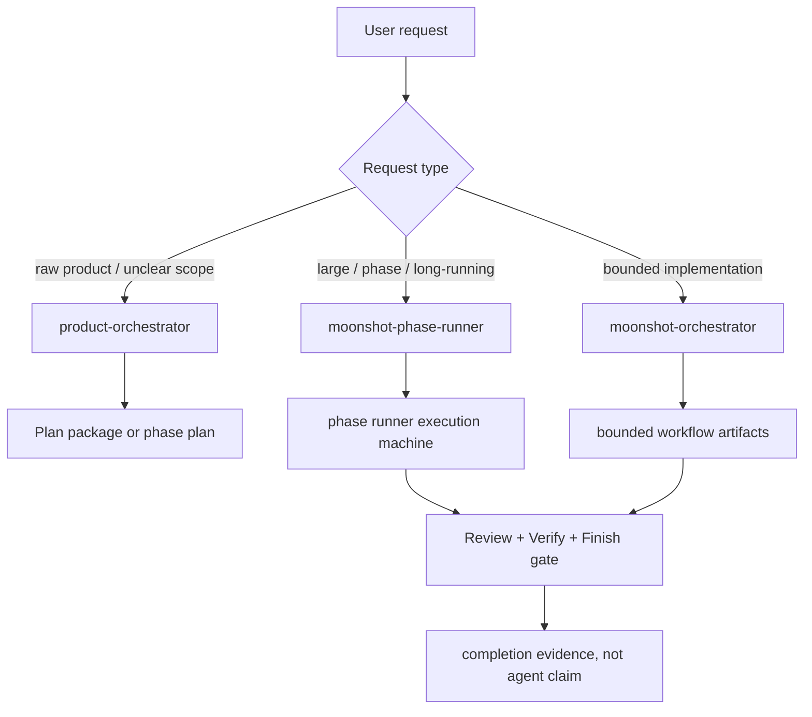
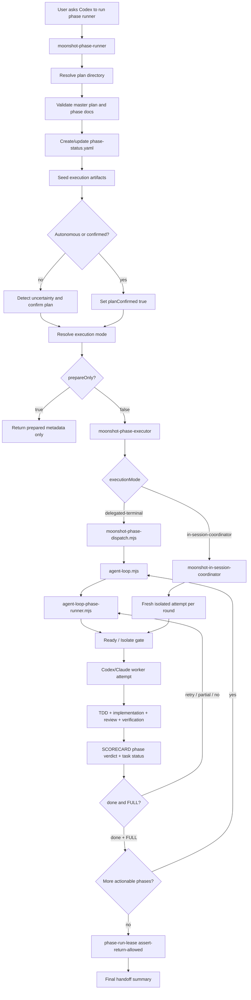
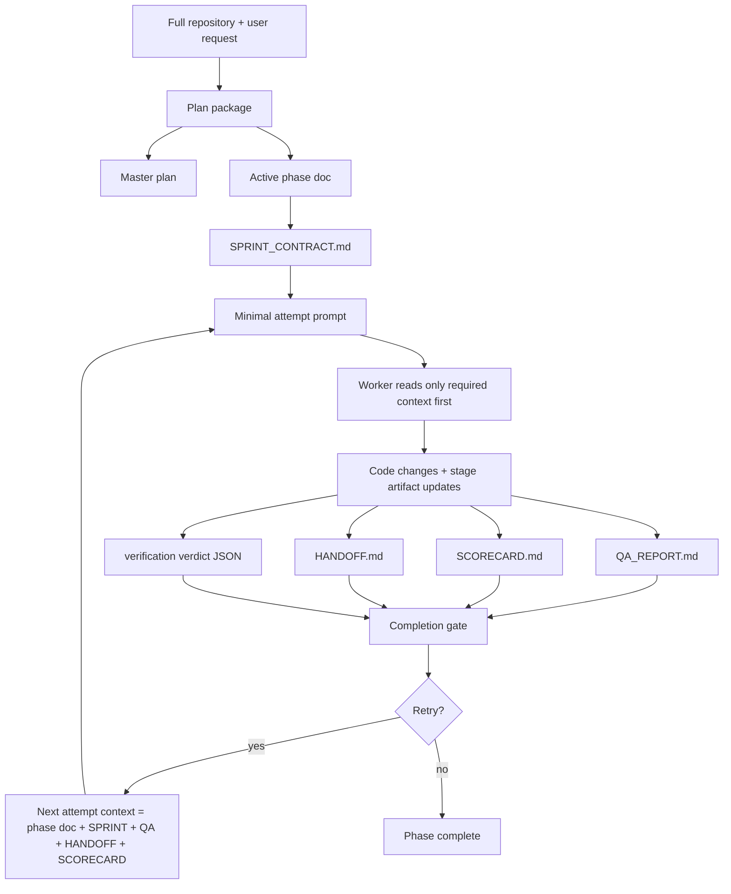

# Codex Phase Runner Workflow

Last-Reviewed: 2026-04-24

## Purpose

이 문서는 Codex가 이 저장소에서 `moonshot-phase-runner`를 사용할 때 실제로 어떤 workflow가 수행되는지 정리한다.

현재 기준의 핵심은 다음이다.

- 공개 진입점은 `product-orchestrator`, `moonshot-phase-runner`, `moonshot-orchestrator` 중심으로 유지한다.
- phase 기반 작업은 `Intake -> Plan -> Ready / Isolate -> Execute -> Review -> Verify -> Finish / Handoff` 7단계 stage model을 따른다.
- 구현 완료는 agent 응답이 아니라 `QA_REPORT.md`, `SCORECARD.md`, verification verdict, lease gate가 판정한다.
- `SCORECARD.md`는 기존 `done / retry / blocked` phase verdict와 함께 task-level `FULL / PARTIAL / NO` 상태를 가진다.
- strict/phase 작업에서는 worktree나 branch뿐 아니라 ignored agent config hydration과 baseline evidence를 Ready / Isolate evidence로 본다.
- 외부 `skills.sh`, SWE-bench, Terminal-Bench, OpenAI Evals, Inspect AI는 production runtime을 대체하지 않고 sandbox pilot 및 export/eval plane으로 연결한다.

## Source Files

| Layer | Path |
|---|---|
| Workspace contract | `.claude/CLAUDE.md` |
| Verification contract | `.claude/verification.contract.yaml` |
| Public entry skill | `.claude/skills/moonshot-phase-runner/SKILL.md` |
| Internal execution skill | `.claude/skills/moonshot-phase-executor/SKILL.md` |
| In-session coordinator skill | `.claude/skills/moonshot-in-session-coordinator/SKILL.md` |
| Stage and bundle map | `.claude/docs/guidelines/skill-composition.md` |
| Dispatcher | `.claude/scripts/moonshot-phase-dispatch.mjs` |
| Delegated autonomous loop | `.claude/scripts/agent-loop.mjs` |
| Single phase runner | `.claude/scripts/agent-loop-phase-runner.mjs` |
| Prompt/artifact builder | `.claude/scripts/agent-loop-phase-plan-lib.mjs` |
| Phase artifact sync | `.claude/scripts/agent-loop-phase-artifacts.mjs` |
| Phase state and completion gate | `.claude/scripts/agent-loop-phase-state.mjs` |
| Return-boundary lease | `.claude/scripts/phase-run-lease.mjs` |
| Runtime adapter | `.claude/scripts/runtime-cli.mjs`, `.claude/scripts/agent-loop-phase-runtime.mjs` |
| Worktree prepare runtime | `.claude/scripts/harness-prepare-worktree.mjs`, `.claude/scripts/harness-prepare-worktree.sh` |
| Scorecard renderer | `.claude/scripts/render-scorecard.py` |
| Verification verdict builder | `.claude/agents/verification/build-verdict-json.py` |
| External skill pilot | `.claude/scripts/external-skills-pilot.mjs` |
| External eval adapter | `.claude/scripts/external-eval-adapter.mjs` |
| Execution templates | `.claude/templates/execution/` |

## Actual Work Locations

| Category | Path or Pattern | Role |
|---|---|---|
| Workspace root | `/Users/dev/claude-settings` | Codex runs from this root and edits files here. |
| Plan directory | `<plan-dir>`, usually `docs/implementation/` | Master plan and phase documents. |
| Master plan | `<plan-dir>/00-master-plan*.md` or `*master*.md` | Defines overall phase sequence. |
| Phase documents | `<plan-dir>/<NN>-*.md` | Active per-phase scope. Archived completed phase docs move under `<plan-dir>/close/`. |
| Phase status | `.claude/docs/phase-status.yaml` | Canonical phase state, active lease metadata, artifact paths, attempts. |
| Execution root | `<plan-dir>/execution/` | Bridge artifacts for every phase. |
| Phase execution dir | `<plan-dir>/execution/<NN>-<slug>/` | Per-phase state package. |
| Sprint contract | `<phase-execution-dir>/SPRINT_CONTRACT.md` | Policy anchors, stage order, exact files/commands/signals, TDD contract, review cadence. |
| QA report | `<phase-execution-dir>/QA_REPORT.md` | Runtime updates, TDD evidence, failure loop evidence, review state, verifier evidence, closeout status. |
| Handoff | `<phase-execution-dir>/HANDOFF.md` | Resume/stop detail when the phase cannot close cleanly. |
| Scorecard | `<phase-execution-dir>/SCORECARD.md` | Objective phase score, `done/retry/blocked` verdict, task-level `FULL/PARTIAL/NO` status. |
| Workset | `<phase-execution-dir>/WORKSET.md` | Attempt-local goal, required reads, produced artifacts, risks. |
| Worktree prepare evidence | `<worktree>/.claude/worktree-prepare.json` | Worktree identity, ignored agent path detection, hydration result, setup/baseline evidence. |
| Traceability | `<plan-dir>/execution/REQUIREMENTS_TRACEABILITY.md` | REQ coverage evidence when present. |
| Scenario matrix | `<plan-dir>/execution/SCENARIO_MATRIX.md` | SCN/runtime coverage evidence when present. |
| UAT checklist | `<plan-dir>/execution/UAT_CHECKLIST.md` | Manual/UAT readiness state when present. |
| Loop logs | `.claude/logs/agent-loop/` | Decision log, live summary, debug JSONL, phase logs. |
| Workflow run state | `.claude/logs/workflow-enforcement/current-run.json` | Current workflow and lease mirror. |
| Active lease | `.claude/logs/workflow-enforcement/active-phase-run.json` | Dispatcher return-boundary lease. |
| Verification verdicts | `.claude/verification-verdict-*.json`, `.claude/runtime-verdict-*.json` | Structured completion evidence. |
| External skill pilot output | `.tmp/external-skill-pilots/skills-sh/` | Sandbox-only install/comparison artifacts. |
| External eval exports | `.tmp/external-eval-plane/` | Terminal-Bench, OpenAI Evals, Inspect skeleton exports. |

## Public Workflow Surface



Public utility entrypoints:

- `session-logger`: explicit session/handoff logging.
- `commit-moonshot`: explicit project-memory update plus commit flow.

Internal skills and bundles are not user-facing entrypoints:

- analysis micro-skills: `moonshot-classify-task`, `moonshot-evaluate-complexity`, `moonshot-detect-uncertainty`, `moonshot-decide-sequence`
- gates: `workspace-isolation-gate`, `verification-evidence-gate`, `context-readiness-gate`
- phase internals: `moonshot-phase-executor`, `moonshot-in-session-coordinator`

## Seven-Stage Model

| Stage | Owner / Bundle | Main artifacts | Completion condition |
|---|---|---|---|
| Intake | public orchestrator or phase runner | user request, active context | request type and workflow profile are known |
| Plan | `moonshot-plan-writer`, `task-slicer`, `codex-validate-plan` | master plan, phase docs, exact task plan | files, commands, expected signals, blockers, review checkpoints are explicit |
| Ready / Isolate | `pre-flight-check`, `project-contract-gate`, `workspace-isolation-gate` | branch/worktree evidence, `.claude/worktree-prepare.json` | isolated workspace and baseline evidence exist when required |
| Execute | `karpathy-execution-gate`, `test-driven-development`, `implementation-runner` | code edits, tests, WORKSET, QA updates | phase scope executed without crossing plan boundary |
| Review | `codex-review-code`, `security-reviewer` when needed | review findings, accepted/challenged/deferred decisions | code-changing work has review evidence |
| Verify | `completion-verifier`, `verification-evidence-gate`, runtime checks | verification verdict JSON, QA evidence | fresh or still-valid evidence matches the phase |
| Finish / Handoff | `doc-auto-sync`, `session-logger`, optional `commit-moonshot` | SCORECARD, HANDOFF, closeout notes | phase verdict and task-level status allow clean finish or record a valid stop |

Small bounded work may compress the stages, but it may not skip verification evidence or unsupported completion-claim checks when risk warrants review/verification.

## Workflow Overview



## End-To-End Sequence

```mermaid
sequenceDiagram
  participant User
  participant Codex
  participant Runner as moonshot-phase-runner
  participant Executor as moonshot-phase-executor
  participant Dispatch as moonshot-phase-dispatch.mjs
  participant Loop as agent-loop.mjs
  participant Phase as agent-loop-phase-runner.mjs
  participant Prepare as Ready/Isolate
  participant Worker as Codex worker
  participant Artifacts as Phase artifacts
  participant Gate as Completion gate
  participant Lease as phase-run-lease

  User->>Codex: Request phase-based execution
  Codex->>Runner: Use public phase entrypoint
  Runner->>Artifacts: Resolve plan, write phase-status.yaml, seed SPRINT/QA/HANDOFF/SCORECARD
  Runner->>Executor: phaseRunnerResult
  Executor->>Dispatch: executionCommand
  Dispatch->>Lease: Start active run lease
  Dispatch->>Loop: Spawn delegated loop
  Loop->>Artifacts: Select next actionable phase
  Loop->>Phase: Run one phase
  Phase->>Artifacts: Ensure current execution package
  Phase->>Prepare: Validate workspace, hydration, baseline when required
  Phase->>Worker: Prompt with active phase and artifact paths
  Worker->>Artifacts: Update TDD evidence, QA, scorecard, verdicts, code
  Phase->>Gate: Evaluate review, verification, phase verdict, task status
  Gate-->>Phase: done+FULL / retry / blocked / PARTIAL / NO
  Phase-->>Loop: Exit code and state update
  Loop->>Artifacts: Advance, retry, or block
  Dispatch->>Lease: Heartbeat and assert return boundary
  Lease-->>Dispatch: RETURN_ALLOWED only when plan directory is complete
  Dispatch-->>Codex: Final return or valid stop handoff
```

## Plan Resolution

When no `<plan-dir>` is supplied, the runner resolves one in this order:

1. Reuse the active plan from `.claude/docs/phase-status.yaml` if it points to an existing master plan.
2. Reuse `docs/implementation/` if it contains exactly one valid master plan and phase files.
3. Reuse another single valid implementation-plan directory only when there is exactly one safe candidate.
4. Otherwise create or refresh `docs/implementation/` through `moonshot-plan-writer`.

If multiple safe candidates exist and no active status file disambiguates them, the runner must stop and ask rather than guessing.

## State Model

`phase-status.yaml` is the canonical shared state. It records:

```yaml
schemaVersion: "1.0"                     # phase state schema version
masterPlan: "docs/implementation/00-master-plan.md" # source master plan
executionMode: "delegated-terminal"      # delegated-terminal or in-session-coordinator
executionRoot: "docs/implementation/execution" # per-phase artifact root
activeExecutionStatus: "active"          # active, completed, blocked, interrupted
activeCurrentStage: "execute"            # current 7-stage model location
phases:                                  # phase list owned by the plan directory
  - number: 1                            # phase number
    title: "Project Setup"               # human-readable phase title
    status: in_progress                  # pending, in_progress, completed, failed
    planConfirmed: true                  # false means runner must not execute yet
    attempts:                            # retry accounting
      total: 1                           # attempt count for this phase
      lastOutcome: running               # running, done, retry, blocked
      lastUpdatedAt: "2026-04-24T00:00:00Z" # latest state update time
    sprintContract: "docs/implementation/execution/01-project-setup/SPRINT_CONTRACT.md" # stage contract
    qaReport: "docs/implementation/execution/01-project-setup/QA_REPORT.md" # execution evidence
    handoff: "docs/implementation/execution/01-project-setup/HANDOFF.md" # stop/resume artifact
    scorecard: "docs/implementation/execution/01-project-setup/SCORECARD.md" # score and task status
```

Actionable phases are phases with `pending`, `in_progress`, or retryable `failed` state where `planConfirmed` is not false.

## Execution Modes

| Mode | Actual path | Intended use | Context rule |
|---|---|---|---|
| `delegated-terminal` | `moonshot-phase-dispatch.mjs` -> `agent-loop.mjs` -> `agent-loop-phase-runner.mjs` -> `codex exec --full-auto -C <workspace>` or Claude CLI | Default for uninterrupted end-to-end execution. | The current Codex session stays attached to the process and does not summarize early. |
| `in-session-coordinator` | `moonshot-phase-dispatch.mjs` -> `moonshot-in-session-coordinator` -> fresh isolated attempt per round | Interactive thin-coordinator mode or fallback. | Main session merges summaries only; implementation should happen in fresh attempts. |

For Codex Desktop, `delegated-terminal` is preferred when the user expects the run to keep going. If Codex in-session coordination cannot fork a fresh attempt, the dispatcher can fall back to delegated-terminal.

## Delegated-Terminal Runtime Flow

```mermaid
flowchart LR
  A["phaseRunnerResult"] --> B["moonshot-phase-executor"]
  B --> C["moonshot-phase-dispatch.mjs"]
  C --> D["start lease"]
  D --> E["agent-loop.mjs"]
  E --> F["get-next-phase"]
  F --> G["agent-loop-phase-runner.mjs --single-phase"]
  G --> H["ensureExecutionArtifacts"]
  H --> I["buildPhasePrompt"]
  I --> J["runtime worker prompt"]
  J --> K["run-worker-prompt-with-completion-gate"]
  K --> L["evaluate-phase-completion-gate"]
  L --> M{"done + FULL?"}
  M -- "yes" --> N["sync clean finish artifacts"]
  M -- "no" --> O["verification/remediation/autofix/retry"]
  O --> J
  N --> P["update phase completed"]
  P --> Q{"next actionable phase?"}
  Q -- "yes" --> F
  Q -- "no" --> R["assert-return-allowed"]
```



The dispatcher also:

- terminates stale workers before launching a new delegated run
- writes heartbeats through `phase-run-lease.mjs`
- restarts the delegated loop if it exits cleanly while actionable phases remain
- marks active phases partial on interruption when safe
- denies success return until the lease confirms no actionable phases remain

## Ready / Isolate Worktree Hydration

Strict or phase-based work must prove the workspace is safe before implementation starts. The gate does not only ask whether a worktree exists; it asks whether the agent harness is usable in that worktree.

Recommended command:

```bash
bash .claude/scripts/harness-prepare-worktree.sh TASK-001 \
  --hydrate-agent-config \
  --baseline-command "npm test"
```

The runtime performs two steps:

1. `git worktree add` creates a code worktree.
2. Agent config hydration overlays `.claude`, `.agents`, and minimal `.codex` scaffold when these paths are ignored in downstream projects.

Copied `.claude` entries:

- `CLAUDE.md`
- `CLAUDE.ko.md`
- `verification.contract.yaml`
- `rules/`
- `skills/`
- `agents/`
- `scripts/`
- `templates/`
- `docs/guidelines/`
- `config/`
- `schemas/`

Excluded sensitive/runtime entries:

- `.claude/logs`
- `.claude/cache`
- `.claude/browser-runtime`
- `.claude/memory.json`
- `.claude/verification-results-*`
- `.claude/verification-verdict-*`
- `.claude/runtime-verdict-*`
- `.claude/knowledge-repo-audit-*`
- `.codex/auth.json`, session, cache, and logs

Evidence written to `<worktree>/.claude/worktree-prepare.json`:

```jsonc
{
  "taskId": "TASK-001",                  // task identifier passed to prepare runtime
  "worktreePath": "/abs/path/.tmp/harness-worktrees/TASK-001", // new worktree root
  "branch": "codex/TASK-001",            // branch checked out in the worktree
  "base": "HEAD",                        // base ref used by git worktree add
  "worktreePathIgnored": true,           // whether the source repo ignores the worktree path
  "agentConfigSource": "/Users/dev/claude-settings/.claude", // config overlay source
  "hydrateAgentConfig": true,            // whether hydration ran
  "ignoredAgentPaths": [".claude"],      // ignored agent paths detected in the source project
  "hydratedPaths": [".claude/skills", ".agents/skills (symlink)", "AGENTS.md (symlink)"], // created bridge paths
  "missingRequiredPaths": [],            // non-empty blocks prepare
  "excludedSensitivePaths": [".claude/logs", ".claude/memory.json"], // never copied paths
  "setupCommand": "",                    // optional setup command
  "setupExitCode": null,                 // null if no setup command
  "setupArtifact": "",                   // setup log path
  "baselineCommand": "npm test",         // baseline command after hydration
  "baselineExitCode": 0,                 // baseline process exit code
  "baselineArtifact": ".claude/worktree-baseline.log", // baseline log path
  "generatedAt": "2026-04-24T00:00:00.000Z" // evidence timestamp
}
```

Harness repo mode and downstream product mode differ:

- Harness repo mode: `.claude` is product source, so tracked files are the primary source of truth.
- Downstream product mode: `.claude`, `.agents`, `.codex` are often ignored overlays, so hydration from a central harness source is required.

## Context Engineering Flow

The design intentionally moves durable context out of chat and into small artifacts.



### Context Boundaries

| Boundary | What crosses it | What must not cross it |
|---|---|---|
| Runner -> executor | `phaseRunnerResult`, paths, mode, counts | Full phase document text unless needed |
| Dispatcher -> loop | command arguments, status file, execution root, runtime | Chat history |
| Loop -> phase runner | one phase number, title, doc path, artifact paths | Other phase implementation scope |
| Phase runner -> worker | generated prompt, active phase doc path, SPRINT/QA/HANDOFF/SCORECARD paths | Previous implementation chatter |
| Worker -> parent loop | artifact updates, verdict JSON, exit code, status file update | Raw long logs as conversational context |
| Retry -> next attempt | QA report, handoff, scorecard, sprint contract | Accumulated hidden reasoning or stale chat summaries |

## Codex Attempt Prompt Structure

For Codex, `buildPhasePrompt` emits a direct phase-attempt fallback. The English prompt content is conceptually:

```text
당신은 이 phase 하나만 수행하는 worker입니다.
moonshot-phase-runner를 다시 호출하지 마세요.
활성 phase 문서와 SPRINT_CONTRACT.md를 먼저 읽으세요.
Ready / Isolate -> Execute -> Review -> Verify -> Finish / Handoff 순서를 유지하세요.
행동 변경 작업이면 production code 전에 failing test를 먼저 작성하세요.
테스트가 불가능하면 이유와 대체 verification path를 QA_REPORT.md에 기록하세요.
계획을 먼저 비판적으로 읽고 blocker가 있으면 추측하지 말고 멈추세요.
동일 failure class가 두 번 반복되면 같은 tactic을 반복하지 마세요.
코드 변경이 있으면 codex-review-code 또는 동등한 review evidence를 남기세요.
fresh verification evidence 없이 완료를 주장하지 마세요.
SCORECARD.md는 Verdict: done 및 Current task status: FULL이어야 clean finish가 가능합니다.
```

The prompt package contains object-level fields like this:

```jsonc
{
  "phaseNumber": 1,                       // active phase number only
  "phaseTitle": "Project Setup",          // active phase title
  "phaseDoc": "docs/implementation/01-project-setup.md", // phase scope file
  "sprintContract": "docs/implementation/execution/01-project-setup/SPRINT_CONTRACT.md", // execution contract
  "qaReport": "docs/implementation/execution/01-project-setup/QA_REPORT.md", // runtime evidence target
  "handoff": "docs/implementation/execution/01-project-setup/HANDOFF.md", // blocked/resume target
  "scorecard": "docs/implementation/execution/01-project-setup/SCORECARD.md", // score and status target
  "requiredStageOrder": ["ready/isolate", "execute", "review", "verify", "finish/handoff"], // local stage model
  "completionRules": {
    "phaseVerdict": "done",               // legacy phase verdict must be done
    "taskStatus": "FULL",                 // task-level status must be FULL
    "freshVerification": true,            // verifier evidence must be fresh or still-valid
    "reviewEvidence": true                // code-changing work requires review evidence
  }
}
```

## Artifact Contracts

### `SPRINT_CONTRACT.md`

Must include:

- policy anchors to `.claude/CLAUDE.md`, `.claude/verification.contract.yaml`, and required rules
- exact files to create, modify, and test
- exact commands to run
- expected fail/pass signals
- blocker conditions
- review checkpoints
- verification evidence paths
- TDD contract for behavior-changing work
- workspace isolation evidence when strict/phase-based

### `QA_REPORT.md`

Must include:

- attempt start and current stage
- red/green/refactor evidence for TDD-first work
- explanation and alternate verification path when tests are impossible
- failure class, root cause evidence, attempted fixes, same failure class count, next tactic
- review evidence
- verification command, exit code, verdict path, freshness claim
- next path: `clean_finish`, `retry_loop`, or `resume_later_handoff`

### `HANDOFF.md`

Must include:

- valid stop reason when the phase does not close cleanly
- remaining work
- rerun commands
- artifacts that the next attempt must read
- why the run stopped

Valid stop reasons are `blocked`, `interrupted`, `context_limit`, `user_pause`, and `deferred_verification`. `verification_failed` is valid as a QA closeout reason, but not as a HANDOFF stop reason.

### `SCORECARD.md`

Must include both verdict layers:

```markdown
## Phase Verdict

- Verdict: done                         # legacy phase verdict: done, retry, or blocked
- Score: 95 / 100                       # objective weighted score
- Target: 90                            # target score for done
- Unmet checklist items: 0              # must be zero for clean finish
- Blocking defects: 0                   # must be zero for clean finish

## Task-Level Status Adapter

- Current task status: FULL             # FULL, PARTIAL, or NO
- fail-to-pass signal: satisfied        # acceptance or feature checks now pass
- pass-to-pass signal: preserved        # regression or existing behavior preserved
- Required verification evidence: present # evidence exists and is referenced
- Status reason: target met with no unmet checklist or blocking defects
```

Rules:

- `FULL`: target score met, unmet checklist 0, blocking defects 0, required verification evidence present.
- `PARTIAL`: build/verification core flow is preserved, but some REQ/SCN/UAT coverage remains.
- `NO`: blocking defect, verification hard gate failure, critical regression, or score below partial threshold.

## Completion Gate

A phase is not complete just because the implementation command exits 0.

The completion gate checks:

- `QA_REPORT.md` says the verifier passed and fresh evidence is confirmed.
- referenced `.claude/verification-verdict-*.json` or `.claude/runtime-verdict-*.json` is fresh and relevant to the phase.
- required checks from `.claude/verification.contract.yaml` are present.
- `codex-review-code` or explicit review evidence is recorded for meaningful code changes.
- `SCORECARD.md` has current score >= target, zero unmet checklist items, zero blocking defects, and `Verdict: done`.
- `SCORECARD.md` has `Current task status: FULL`.
- finish-closeout fields are concrete, with no placeholder handoff shape.
- `HANDOFF.md` is either clean-finish compatible or accurately records a valid stop reason.

If any of these fail, the runner records the reason in QA/HANDOFF and enters verification remediation, closeout remediation, auto-fix, timeout retry, runtime fallback, or failed/blocked handling.

Clean finish is blocked when:

- scorecard task status is `PARTIAL` or `NO`
- task status is missing and cannot be inferred from legacy done/score/unmet/blocking fields
- review evidence is missing for code-changing work
- verification evidence is stale, missing, or unrelated
- finish or handoff fields are seeded placeholders

## Failure Loop

Failure handling follows a systematic debugging contract:

```jsonc
{
  "failureClass": "verification_contract", // stable category for repeated failures
  "rootCauseEvidence": "missing runtime verdict path in QA_REPORT.md", // observed evidence
  "attemptedFixes": ["added verdict file but not QA reference"], // fixes already tried
  "sameFailureClassCount": 2,              // repeated count for this failure class
  "nextTactic": "change closeout artifact sync before rerunning verifier" // changed tactic after repeat
}
```

Rules:

- Do not patch before identifying the cause.
- Do not repeat the same tactic after the same failure class repeats twice.
- After three failed attempts, escalate to design/contract issue rather than continuing blind retry.
- `build-error-resolver` and implementation recovery must record cause evidence before claiming a fix.

## Return Boundary

The success boundary is the active plan directory, not a single phase.

The dispatcher may emit a final success only after:

```text
node .claude/scripts/phase-run-lease.mjs assert-return-allowed <status-file> <runLeaseId> true false
```

returns `RETURN_ALLOWED=true`.

Return is denied when:

- actionable phases remain
- the active lease is missing, inactive, or stale
- execution intent was expressed and the runner is not in prepare-only mode
- the current phase has `retry`, `blocked`, `PARTIAL`, or `NO`

Valid stop boundaries are:

- all actionable phases completed
- retry cap reached
- explicit user pause/interruption
- blocked environment/contract/dependency
- real dispatcher or worker failure recorded in QA/HANDOFF/status

Invalid stop boundaries are:

- one completed phase while other phases remain
- a checkpoint artifact refresh
- a partial attempt summary
- verification-complete without review and finish-closeout
- `SCORECARD.md` still saying `retry` or `blocked`
- `SCORECARD.md` task status still saying `PARTIAL` or `NO`

## External Harness and Skill Plane

External tools are handled as pattern sources and eval/export layers, not as production runtime replacements.

| Candidate | Current handling | Local integration target |
|---|---|---|
| `skills.sh` production skills | sandbox pilot only | compare source pattern, then adapt local skills |
| `requirements-analysis` / `system-design` | adapt | `product-orchestrator`, `moonshot-plan-writer`, design gates |
| `writing-plans` / `executing-plans` | adapt | exact plan contract, `codex-validate-plan`, `SPRINT_CONTRACT` |
| `using-git-worktrees` | adapt | `workspace-isolation-gate`, `harness-prepare-worktree` |
| `requesting-code-review` / `receiving-code-review` | adapt | `codex-review-code`, QA review decisions |
| `verification-before-completion` | adopt as local rule | `completion-verifier`, `verification-evidence-gate`, completion gate |
| `test-driven-development` | adopt as local skill | `test-driven-development`, `SPRINT_CONTRACT`, `QA_REPORT` |
| `systematic-debugging` | adopt as local rule | `failure-analyzer`, recovery loop |
| SWE-bench | concept only | fail-to-pass/pass-to-pass vocabulary in scorecard |
| Terminal-Bench / Harbor | export adapter | terminal benchmark task skeleton |
| OpenAI Evals | export adapter | JSONL rubric for evidence/resumability/traceability |
| Inspect AI | export adapter | formal eval manifest skeleton |

External pilot output:

- `.tmp/external-skill-pilots/skills-sh/manifest.json`
- `docs/claude-tasks/external-harness-adoption/pilot-results.md`
- `docs/claude-tasks/external-harness-adoption/pilot-results.ko.md`

Eval export command shape:

```bash
node .claude/scripts/external-eval-adapter.mjs terminal-bench --task-id TASK-001 --source docs/implementation
node .claude/scripts/external-eval-adapter.mjs openai-evals --task-id TASK-001 --source docs/implementation
node .claude/scripts/external-eval-adapter.mjs inspect --task-id TASK-001 --source docs/implementation
```

These commands create export artifacts even when the external tool is not installed; actual execution is optional and reports `tool_missing` safely.

## Practical Mental Model

The phase runner is not a single implementation prompt. It is an artifact-backed execution machine:

```text
user request
  -> public entrypoint selection
  -> 7-stage workflow
  -> plan docs
  -> phase-status.yaml
  -> per-phase execution artifacts
  -> Ready / Isolate evidence
  -> isolated worker attempt
  -> TDD / implementation / review / verification
  -> SCORECARD done + FULL
  -> retry or next phase
  -> lease-approved final return
```

The durable memory is the filesystem package, not the conversation. Codex may coordinate, but the phase artifacts decide what the next attempt knows and whether the run may stop.
