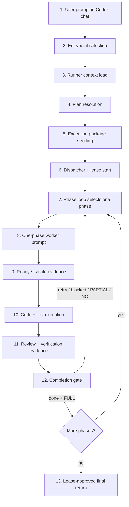
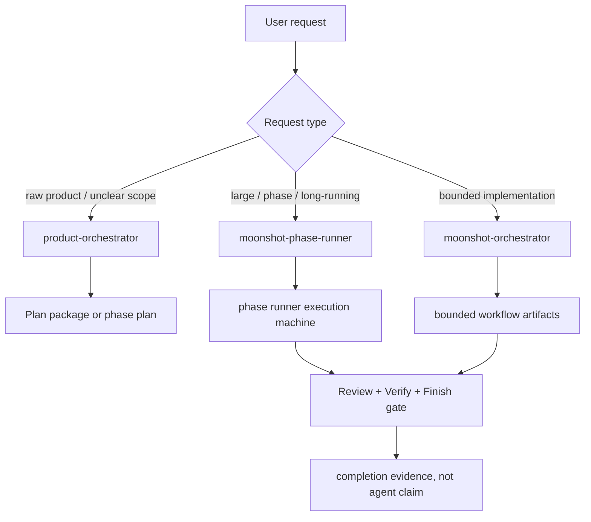
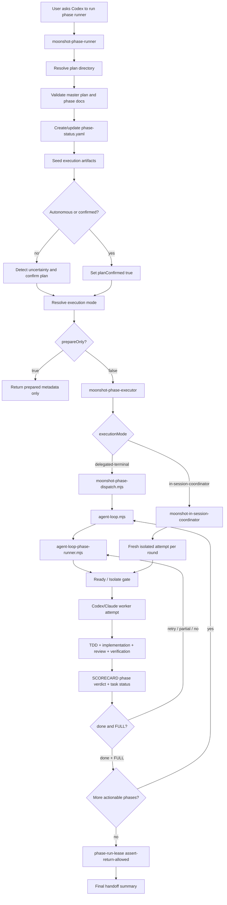
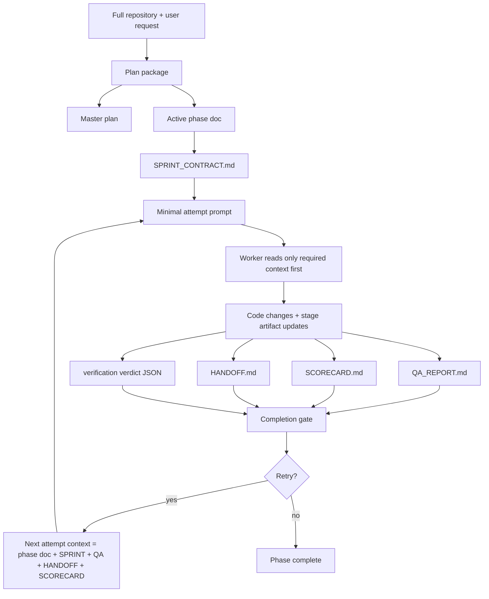

# Codex Phase Runner Workflow

Last-Reviewed: 2026-05-06

## Purpose

이 문서는 Codex가 이 저장소에서 `moonshot-phase-runner`를 사용할 때 실제로 어떤 workflow가 수행되는지 정리한다.

현재 기준의 핵심은 다음이다.

- 공개 진입점은 `product-orchestrator`, `moonshot-phase-runner`, `moonshot-orchestrator` 중심으로 유지한다.
- phase 기반 작업은 `Intake -> Plan -> Ready / Isolate -> Execute -> Review -> Verify -> Finish / Handoff` 7단계 stage model을 따른다.
- 구현 완료는 agent 응답이 아니라 `QA_REPORT.md`, `SCORECARD.md`, verification verdict, lease gate가 판정한다.
- `SCORECARD.md`는 기존 `done / retry / blocked` phase verdict와 함께 task-level `FULL / PARTIAL / NO` 상태를 가진다.
- strict/phase 작업에서는 worktree나 branch뿐 아니라 ignored agent config hydration과 baseline evidence를 Ready / Isolate evidence로 본다.
- 외부 `skills.sh`, SWE-bench, Terminal-Bench, OpenAI Evals, Inspect AI는 production runtime을 대체하지 않고 sandbox pilot 및 export/eval plane으로 연결한다.

## Waste Reduction Follow-up Package

`docs/implementation/moonshot-harness-waste-reduction-2026-05-06/` is the active follow-up package for the 2026-05-06 waste analysis.

- Package index: `docs/implementation/moonshot-harness-waste-reduction-2026-05-06/README.md`
- Phase 06 regression sync: `docs/implementation/moonshot-harness-waste-reduction-2026-05-06/06-regression-doc-sync-v1.md`
- Non-overlap boundary: completed work under `docs/implementation/harness-reliability-retro-2026-05-05/` and `docs/implementation/harness-native-awtl-rsme-2026-05-06/` stays read-only

## User-Facing Flow

처음 보는 개발자는 아래 순서로 이해하면 된다. 사용자는 Codex 채팅창에 요청을 입력하지만, 실제로는 채팅 안에서 끝나는 것이 아니라 repository 파일과 스크립트가 실행 상태를 이어받는다.

```text
Codex chat session
  -> user asks for phase-based execution
  -> Codex selects moonshot-phase-runner skill
  -> runner reads workspace contract and plan documents
  -> runner creates/updates phase-status.yaml
  -> runner seeds SPRINT/QA/HANDOFF/SCORECARD files
  -> executor starts dispatcher script
  -> dispatcher starts delegated worker loop
  -> worker receives one-phase prompt
  -> worker edits code and artifact files
  -> completion gate reads evidence files
  -> retry, next phase, or final return
```

### Walkthrough map

아래 도식은 “사용자 채팅”에서 “최종 반환”까지 이어지는 실제 흐름이다. 각 박스는 다음 subsection에서 다시 풀어 설명한다.



### Three lanes to keep in mind

페이즈러너를 이해할 때는 “AI가 답변한다”가 아니라 세 개의 lane이 동시에 움직인다고 보면 된다.

| Lane | What it means | Where to look |
|---|---|---|
| Chat lane | 사용자가 보는 Codex 대화와 진행 업데이트 | 현재 Codex chat session |
| Filesystem lane | 다음 시도와 완료 판정을 위해 남기는 durable state | `.claude/docs/phase-status.yaml`, `<plan-dir>/execution/<phase>/` |
| Process lane | 실제 loop, worker, verifier를 실행하는 script/process | `.claude/scripts/moonshot-phase-dispatch.mjs`, `agent-loop.mjs`, `agent-loop-phase-runner.mjs` |

핵심은 chat lane이 아니라 filesystem lane이 진짜 기억이라는 점이다. Codex가 중간에 멈추거나 context가 줄어도 다음 시도는 `QA_REPORT.md`, `HANDOFF.md`, `SCORECARD.md`, `phase-status.yaml`을 읽고 이어간다.

### Role map

| Actor | Responsibility | Does not own |
|---|---|---|
| User | 목표와 우선순위를 요청하고, 필요한 경우 모호한 plan 후보를 선택한다. | phase 내부 완료 판정 |
| Current Codex session | entrypoint 선택, phase runner 시작, 진행 상황 전달, 최종 요약 반환 | 각 phase의 장기 구현 context |
| `moonshot-phase-runner` | plan directory 확인, phase state 생성, execution package 준비 | 직접 code edit |
| Dispatcher | lease 생성, runtime 선택, loop 실행, 반환 경계 감시 | feature 구현 판단 |
| Agent loop | 다음 actionable phase 선택, retry/next phase 반복 | 전체 요구사항 재정의 |
| Worker attempt | 한 phase의 구현, 테스트, artifact 업데이트 | 다른 phase 범위 구현 |
| Completion gate | evidence, scorecard, handoff를 읽고 clean finish 여부 판단 | agent 말만 믿고 완료 처리 |

### State transitions

페이즈 하나는 대략 아래 상태를 지난다.

```text
pending
  -> in_progress
  -> ready/isolate checked
  -> execute attempted
  -> review recorded
  -> verification recorded
  -> scorecard evaluated
  -> completed
```

실패하거나 evidence가 부족하면 completed로 가지 않고 다음 중 하나가 된다.

```text
retry      # 같은 phase를 다시 시도한다. 단, 같은 failure class 반복 시 tactic을 바꿔야 한다.
blocked    # 환경, 계약, 의존성, 설계 문제로 더 진행할 수 없다.
PARTIAL    # 핵심 흐름은 유지되지만 acceptance/coverage가 남았다.
NO         # hard gate 실패, critical regression, blocking defect 등으로 완료 불가다.
```

### How a junior developer can inspect the current run

현재 어디까지 진행됐는지 알고 싶으면 아래 순서로 보면 된다.

1. `.claude/docs/phase-status.yaml`
   - active plan directory가 무엇인지 본다.
   - 어떤 phase가 `pending`, `in_progress`, `completed`, `failed`인지 본다.

2. `<plan-dir>/execution/<phase>/SPRINT_CONTRACT.md`
   - worker가 이번 phase에서 무엇을 해야 하는지 본다.
   - exact files, commands, expected signals가 있는지 본다.

3. `<plan-dir>/execution/<phase>/QA_REPORT.md`
   - 지금 어느 stage인지 본다.
   - TDD evidence, failure cause, review, verification evidence가 있는지 본다.

4. `<plan-dir>/execution/<phase>/SCORECARD.md`
   - `Verdict: done`인지 본다.
   - `Current task status: FULL`인지 본다.
   - unmet checklist와 blocking defects가 0인지 본다.

5. `<plan-dir>/execution/<phase>/HANDOFF.md`
   - clean finish가 아닌 경우 왜 멈췄는지 본다.
   - 다음 시도에서 무엇을 읽고 어떤 command를 다시 돌려야 하는지 본다.

### What changes between normal success, retry, and blocked paths

| Path | What user may see | Artifact shape | Next action |
|---|---|---|---|
| Success | phase가 완료되고 다음 phase로 넘어가거나 최종 요약이 나온다. | `SCORECARD.md` has `Verdict: done` and `Current task status: FULL`. | next phase or final return |
| Retry | Codex가 같은 phase를 다시 시도한다. | `QA_REPORT.md` records failure class, root cause evidence, next tactic. | same phase, changed tactic |
| Partial | 핵심 실행은 되었지만 coverage나 acceptance gap이 남는다. | `SCORECARD.md` has `Current task status: PARTIAL`. | close gaps before clean finish |
| Blocked | 환경/계약/설계 문제로 진행이 멈춘다. | `HANDOFF.md` has valid stop reason and resume instructions. | human decision or dependency fix |
| No | hard gate나 critical regression으로 완료 불가다. | `SCORECARD.md` has `Current task status: NO`. | redesign, replan, or rollback |

### Common beginner misunderstanding

- “Codex가 완료했다고 말했다”는 완료 조건이 아니다. `SCORECARD.md`와 verdict JSON이 완료 조건이다.
- “테스트를 실행했다”는 evidence가 아니다. command, exit code, artifact path, freshness가 함께 있어야 한다.
- “Phase 1이 끝났다”는 전체 작업 완료가 아니다. actionable phase가 남아 있으면 final response boundary가 아니다.
- “worktree가 있다”는 Ready / Isolate 통과가 아니다. ignored agent config hydration과 baseline evidence가 필요할 수 있다.
- “다시 시도했다”는 충분하지 않다. 같은 failure class가 반복되면 next tactic이 달라져야 한다.

### Step 1. Codex 채팅 세션에서 요청이 들어온다

사용자가 보는 것:

```text
docs/implementation phase plan을 끝까지 실행해줘.
```

이때 AI에 잡히는 기본 컨텍스트:

- 현재 workspace root: `/Users/dev/claude-settings`
- 사용자의 자연어 요청
- 현재 세션에서 사용 가능한 skill 목록
- 항상 참조해야 하는 repository contract: `AGENTS.md`, `.claude/CLAUDE.md`, `.claude/verification.contract.yaml`

실제 실행:

- 아직 script는 실행하지 않는다.
- Codex는 요청이 “bounded single task”인지, “제품 정의”인지, “phase 기반 장기 실행”인지 먼저 분류한다.

다음 단계 조건:

- 요청이 large/phase/long-running 구현이면 `moonshot-phase-runner`가 선택된다.

### Step 2. `moonshot-phase-runner` skill이 선택된다

사용자가 보는 것:

- Codex가 “phase runner로 진행하겠다”는 취지의 진행 업데이트를 낼 수 있다.

이때 AI에 추가되는 컨텍스트:

- `.claude/skills/moonshot-phase-runner/SKILL.md`
- `.claude/docs/guidelines/skill-composition.md`
- `.claude/CLAUDE.md`
- `.claude/verification.contract.yaml`

중요한 규칙:

- phase 완료가 아니라 plan directory 전체 완료가 반환 경계다.
- `--prepare-only`가 아니면 실행 intent로 해석한다.
- Codex에서는 uninterrupted execution이 필요하면 `delegated-terminal`을 우선한다.

실제 실행:

- 아직 worker는 시작하지 않는다.
- runner가 plan directory를 찾기 위한 준비를 한다.

다음 단계 조건:

- 명시적인 `<plan-dir>`가 있으면 그 경로를 우선 사용한다.
- 없으면 active `phase-status.yaml` 또는 `docs/implementation/`을 탐색한다.

### Step 3. Runner가 plan과 workspace contract를 읽는다

AI가 읽는 파일:

```text
.claude/CLAUDE.md
.claude/verification.contract.yaml
.claude/docs/phase-status.yaml                 # 있으면 active plan 재사용 후보
docs/implementation/00-master-plan*.md          # 있으면 master plan 후보
docs/implementation/<NN>-*.md                   # phase 문서 후보
```

AI가 설정하는 내부 판단:

- 이 작업이 이미 진행 중인 phase run인지
- master plan과 phase documents가 충분한지
- phase가 몇 개이고 어떤 순서인지
- 사용자가 Q&A 없이 autonomous로 진행하라고 했는지

실제 실행:

- plan directory resolution logic이 실행된다.
- 안전한 plan 후보가 없으면 `moonshot-plan-writer`로 plan 생성을 유도한다.

다음 단계 조건:

- master plan과 phase docs가 확인되면 phase state를 만들 수 있다.
- 후보가 여러 개면 추측하지 않고 사용자 확인이 필요하다.

### Step 4. `phase-status.yaml`과 execution package가 만들어진다

사용자가 보는 것:

- “phase plan을 찾았고 execution artifacts를 준비한다”는 진행 업데이트가 나올 수 있다.

실제 생성/수정 파일:

```text
.claude/docs/phase-status.yaml
<plan-dir>/execution/<phase>/SPRINT_CONTRACT.md
<plan-dir>/execution/<phase>/QA_REPORT.md
<plan-dir>/execution/<phase>/HANDOFF.md
<plan-dir>/execution/<phase>/SCORECARD.md
```

이때 설정되는 컨텍스트:

- phase number/title/status
- execution mode
- execution root
- active stage
- artifact path mapping
- stage order: `ready/isolate -> execute -> review -> verify -> finish/handoff`

실제 실행 파일:

- `.claude/scripts/agent-loop-phase-artifacts.mjs`
- `.claude/templates/execution/*`

핵심 산출물 의미:

- `SPRINT_CONTRACT.md`: 이번 phase worker가 따라야 할 계약
- `QA_REPORT.md`: 시도, TDD, 실패, review, verification 기록
- `HANDOFF.md`: 막혔거나 중단될 때 다음 시도에 넘기는 파일
- `SCORECARD.md`: 점수, `done/retry/blocked`, `FULL/PARTIAL/NO`

다음 단계 조건:

- `--prepare-only`면 여기서 사용자에게 준비 결과만 반환한다.
- 기본값이면 executor/dispatcher로 넘어간다.

### Step 5. Executor가 dispatcher command를 만든다

사용자가 보는 것:

- 일반적으로 긴 설명 없이 실행이 이어진다.

AI가 넘기는 실행 컨텍스트:

```jsonc
{
  "planDir": "docs/implementation",       // 실행할 plan directory
  "executionRoot": "docs/implementation/execution", // phase artifact root
  "executionMode": "delegated-terminal",  // 기본 장기 실행 모드
  "runtime": "codex",                     // active runtime
  "prepareOnly": false,                   // 준비만 하고 멈출지 여부
  "phaseStatus": ".claude/docs/phase-status.yaml" // canonical state file
}
```

실제 실행:

```bash
node .claude/scripts/moonshot-phase-dispatch.mjs docs/implementation --runtime codex
```

생성/수정 파일:

```text
.claude/logs/workflow-enforcement/active-phase-run.json
.claude/logs/workflow-enforcement/current-run.json
.claude/logs/agent-loop/
```

다음 단계 조건:

- dispatcher가 lease를 잡으면 agent loop가 시작된다.
- lease는 “아직 최종 응답하면 안 된다”는 반환 경계 역할을 한다.

### Step 6. Agent loop가 다음 phase 하나를 고른다

AI에 설정되는 컨텍스트:

- active lease id
- target runtime
- retry cap
- 다음 actionable phase
- 해당 phase의 artifact path

실제 실행:

```bash
node .claude/scripts/agent-loop.mjs ...
node .claude/scripts/agent-loop-phase-runner.mjs --single-phase ...
```

읽는 파일:

```text
.claude/docs/phase-status.yaml
<plan-dir>/<NN>-*.md
<plan-dir>/execution/<phase>/SPRINT_CONTRACT.md
<plan-dir>/execution/<phase>/QA_REPORT.md
<plan-dir>/execution/<phase>/HANDOFF.md
<plan-dir>/execution/<phase>/SCORECARD.md
```

다음 단계 조건:

- phase 하나만 worker에게 넘긴다.
- 다른 phase scope는 worker prompt에 섞지 않는다.

### Step 7. Worker prompt가 만들어지고 Codex worker가 실행된다

Worker가 받는 의미상 prompt:

```text
이번 시도에서는 Phase 1만 수행한다.
moonshot-phase-runner를 다시 호출하지 마라.
phase doc과 SPRINT_CONTRACT.md를 먼저 읽어라.
Ready / Isolate -> Execute -> Review -> Verify -> Finish / Handoff 순서를 유지하라.
행동 변경이면 production code 전에 failing test를 작성하라.
fresh verification evidence 없이 완료를 주장하지 마라.
완료하려면 SCORECARD.md가 Verdict: done과 Current task status: FULL이어야 한다.
```

실제 runtime command 형태:

```bash
codex exec --full-auto -C <workspace>
```

Worker에게 전달되는 핵심 파일 경로:

```text
phaseDoc=<plan-dir>/<NN>-*.md
sprintContract=<plan-dir>/execution/<phase>/SPRINT_CONTRACT.md
qaReport=<plan-dir>/execution/<phase>/QA_REPORT.md
handoff=<plan-dir>/execution/<phase>/HANDOFF.md
scorecard=<plan-dir>/execution/<phase>/SCORECARD.md
```

다음 단계 조건:

- worker는 먼저 artifact를 읽고 attempt checkpoint를 남긴다.
- 그 다음에만 구현을 시작한다.

### Step 8. Ready / Isolate evidence가 확인된다

왜 필요한가:

- 실제 작업 프로젝트에서는 `.claude`, `.agents`, `.codex`가 `.gitignore`에 들어가는 경우가 많다.
- 새 worktree에는 tracked 파일만 생기므로 agent 설정이 빠질 수 있다.
- 그래서 “worktree가 있다”가 아니라 “worktree에서도 harness가 동작한다”를 확인해야 한다.

실행할 수 있는 prepare command:

```bash
bash .claude/scripts/harness-prepare-worktree.sh TASK-001 \
  --hydrate-agent-config \
  --baseline-command "npm test"
```

생성되는 evidence:

```text
<worktree>/.claude/worktree-prepare.json
<worktree>/.claude/worktree-baseline.log
<worktree>/.claude/...
<worktree>/.agents/skills
<worktree>/AGENTS.md
<worktree>/.codex/
```

AI가 확인하는 항목:

- branch 또는 worktree identifier
- `.claude/.agents/.codex` ignore 감지 결과
- agent config source
- hydration 여부
- setup command와 baseline command
- baseline exit code와 artifact path

다음 단계 조건:

- strict/phase 작업에서 evidence가 없으면 implementation으로 들어가면 안 된다.
- baseline이 실패하면 먼저 실패 원인을 기록하고 replan 또는 blocker로 처리한다.

### Step 9. Worker가 구현과 테스트를 수행한다

AI에 설정되는 컨텍스트:

- `SPRINT_CONTRACT.md`의 exact files to create/modify/test
- exact commands to run
- expected fail/pass signal
- blocker condition
- TDD-first 규칙
- failure-loop 규칙

실제 수행 예:

```bash
pytest tests/test_feature.py -v
npm test
node --test
npm run build
```

Worker가 수정하는 파일:

- product source files
- tests
- `QA_REPORT.md`
- `SCORECARD.md`
- 필요 시 `HANDOFF.md`

QA에 남겨야 하는 evidence:

- failing test를 먼저 봤는지
- pass condition이 무엇인지
- refactor boundary가 어디인지
- 테스트가 불가능하면 왜 불가능하고 어떤 대체 verification을 썼는지

다음 단계 조건:

- 구현이 끝나도 review와 verification이 남아 있다.
- worker는 바로 완료를 선언하면 안 된다.

### Step 10. Review와 verification evidence가 생성된다

Review 컨텍스트:

- code-changing work인지
- review owner가 누구인지
- critical/important/minor findings가 있는지
- findings를 accepted/challenged/deferred 중 어떻게 처리했는지

Verification 컨텍스트:

- `.claude/verification.contract.yaml`
- phase-specific required checks
- fresh evidence rule
- runtime/build/test command 결과

생성 파일:

```text
.claude/verification-verdict-*.json
.claude/runtime-verdict-*.json
<phase-execution-dir>/QA_REPORT.md
```

중요한 차이:

- “테스트를 돌렸다”가 아니라 command, exit code, verdict path, freshness가 기록돼야 한다.
- code-changing work는 review evidence 없이 clean finish가 불가능하다.

다음 단계 조건:

- verification evidence가 fresh하고 relevant하면 scorecard를 갱신한다.
- 실패하면 failure class와 root cause evidence를 기록하고 retry loop로 돌아간다.

### Step 11. Completion gate가 `done + FULL`을 판정한다

Gate가 읽는 파일:

```text
<phase-execution-dir>/QA_REPORT.md
<phase-execution-dir>/SCORECARD.md
<phase-execution-dir>/HANDOFF.md
.claude/verification-verdict-*.json
.claude/runtime-verdict-*.json
```

실제 평가 script:

```bash
node .claude/scripts/agent-loop-phase-state.mjs ...
```

통과 조건:

- `QA_REPORT.md`가 fresh verification evidence를 참조한다.
- code-changing work면 review evidence가 있다.
- `SCORECARD.md`가 target 이상이다.
- unmet checklist가 0이다.
- blocking defects가 0이다.
- `Verdict: done`이다.
- `Current task status: FULL`이다.
- `HANDOFF.md`가 clean finish와 충돌하지 않는다.

실패 시:

- `retry`면 같은 phase를 다시 실행한다.
- `PARTIAL`이면 coverage나 acceptance gap을 보완한다.
- `NO` 또는 `blocked`면 blocker/handoff를 남긴다.

### Step 12. 다음 phase로 넘어가거나 최종 반환한다

phase가 `done + FULL`이면 loop는 다음 actionable phase를 찾는다.

```text
Phase 1 done + FULL
  -> Phase 2 pending? yes
  -> return to agent-loop
  -> build Phase 2 one-phase prompt
```

모든 phase가 끝났을 때만 dispatcher가 최종 반환을 확인한다.

```bash
node .claude/scripts/phase-run-lease.mjs assert-return-allowed <status-file> <runLeaseId> true false
```

최종 반환이 허용되는 조건:

- actionable phase가 없다.
- active lease가 유효하다.
- 마지막 phase가 clean finish 상태다.
- stop reason이 있다면 valid stop reason이다.

사용자에게 돌아오는 최종 응답:

- 완료된 phase 요약
- 실행한 verification evidence
- scorecard status
- 남은 handoff가 있으면 그 이유

### Compact summary table

| Step | User-visible moment | Main context | Main command/file | Output |
|---|---|---|---|---|
| 1 | Chat request | user request, workspace contract | entrypoint decision | selected workflow |
| 2 | Phase runner selected | skill + contract + verification rules | `moonshot-phase-runner/SKILL.md` | plan lookup starts |
| 3 | Plan loaded | master plan, phase docs | plan resolution | active `<plan-dir>` |
| 4 | Execution package prepared | phase list, stage order | artifact seeding | SPRINT/QA/HANDOFF/SCORECARD |
| 5 | Dispatcher starts | `phaseRunnerResult` | `moonshot-phase-dispatch.mjs` | active lease |
| 6 | Loop starts | next actionable phase | `agent-loop.mjs` | one phase selected |
| 7 | Worker runs | one-phase prompt | `codex exec --full-auto` | attempt checkpoint |
| 8 | Ready / Isolate | worktree and hydration evidence | `harness-prepare-worktree.sh` | `worktree-prepare.json` |
| 9 | Implementation | exact plan + TDD rule | project test/build commands | code/tests/QA updates |
| 10 | Review/verify | review + verification contract | verdict writer/check runner | verdict JSON |
| 11 | Completion gate | QA + scorecard + handoff | `agent-loop-phase-state.mjs` | done+FULL or retry/block |
| 12 | Return boundary | lease + phase status | `phase-run-lease.mjs` | final response |

## Source Files

| Layer | Path |
|---|---|
| Workspace contract | `.claude/CLAUDE.md` |
| Verification contract | `.claude/verification.contract.yaml` |
| Public entry skill | `.claude/skills/moonshot-phase-runner/SKILL.md` |
| Internal execution skill | `.claude/skills/moonshot-phase-executor/SKILL.md` |
| In-session coordinator skill | `.claude/skills/moonshot-in-session-coordinator/SKILL.md` |
| Stage and bundle map | `.claude/docs/guidelines/skill-composition.md` |
| Dispatcher | `.claude/scripts/moonshot-phase-dispatch.mjs` |
| Delegated autonomous loop | `.claude/scripts/agent-loop.mjs` |
| Single phase runner | `.claude/scripts/agent-loop-phase-runner.mjs` |
| Prompt/artifact builder | `.claude/scripts/agent-loop-phase-plan-lib.mjs` |
| Phase artifact sync | `.claude/scripts/agent-loop-phase-artifacts.mjs` |
| Phase state and completion gate | `.claude/scripts/agent-loop-phase-state.mjs` |
| Return-boundary lease | `.claude/scripts/phase-run-lease.mjs` |
| Runtime adapter | `.claude/scripts/runtime-cli.mjs`, `.claude/scripts/agent-loop-phase-runtime.mjs` |
| Worktree prepare runtime | `.claude/scripts/harness-prepare-worktree.mjs`, `.claude/scripts/harness-prepare-worktree.sh` |
| Scorecard renderer | `.claude/scripts/render-scorecard.py` |
| Verification verdict builder | `.claude/agents/verification/build-verdict-json.py` |
| External skill pilot | `.claude/scripts/external-skills-pilot.mjs` |
| External eval adapter | `.claude/scripts/external-eval-adapter.mjs` |
| Execution templates | `.claude/templates/execution/` |

## Actual Work Locations

| Category | Path or Pattern | Role |
|---|---|---|
| Workspace root | `/Users/dev/claude-settings` | Codex runs from this root and edits files here. |
| Plan directory | `<plan-dir>`, usually `docs/implementation/` | Master plan and phase documents. |
| Master plan | `<plan-dir>/00-master-plan*.md` or `*master*.md` | Defines overall phase sequence. |
| Phase documents | `<plan-dir>/<NN>-*.md` | Active per-phase scope. Archived completed phase docs move under `<plan-dir>/close/`. |
| Phase status | `.claude/docs/phase-status.yaml` | Canonical phase state, active lease metadata, artifact paths, attempts. |
| Execution root | `<plan-dir>/execution/` | Bridge artifacts for every phase. |
| Phase execution dir | `<plan-dir>/execution/<NN>-<slug>/` | Per-phase state package. |
| Sprint contract | `<phase-execution-dir>/SPRINT_CONTRACT.md` | Policy anchors, stage order, exact files/commands/signals, TDD contract, review cadence. |
| QA report | `<phase-execution-dir>/QA_REPORT.md` | Runtime updates, TDD evidence, failure loop evidence, review state, verifier evidence, closeout status. |
| Handoff | `<phase-execution-dir>/HANDOFF.md` | Resume/stop detail when the phase cannot close cleanly. |
| Scorecard | `<phase-execution-dir>/SCORECARD.md` | Objective phase score, `done/retry/blocked` verdict, task-level `FULL/PARTIAL/NO` status. |
| Workset | `<phase-execution-dir>/WORKSET.md` | Attempt-local goal, required reads, produced artifacts, risks. |
| Worktree prepare evidence | `<worktree>/.claude/worktree-prepare.json` | Worktree identity, ignored agent path detection, hydration result, setup/baseline evidence. |
| Traceability | `<plan-dir>/execution/REQUIREMENTS_TRACEABILITY.md` | REQ coverage evidence when present. |
| Scenario matrix | `<plan-dir>/execution/SCENARIO_MATRIX.md` | SCN/runtime coverage evidence when present. |
| UAT checklist | `<plan-dir>/execution/UAT_CHECKLIST.md` | Manual/UAT readiness state when present. |
| Loop logs | `.claude/logs/agent-loop/` | Decision log, live summary, debug JSONL, phase logs. |
| Workflow run state | `.claude/logs/workflow-enforcement/current-run.json` | Current workflow and lease mirror. |
| Active lease | `.claude/logs/workflow-enforcement/active-phase-run.json` | Dispatcher return-boundary lease. |
| Verification verdicts | `.claude/verification-verdict-*.json`, `.claude/runtime-verdict-*.json` | Structured completion evidence. |
| External skill pilot output | `.tmp/external-skill-pilots/skills-sh/` | Sandbox-only install/comparison artifacts. |
| External eval exports | `.tmp/external-eval-plane/` | Terminal-Bench, OpenAI Evals, Inspect skeleton exports. |

## Public Workflow Surface



Public utility entrypoints:

- `session-logger`: explicit session/handoff logging.
- `commit-moonshot`: explicit project-memory update plus commit flow.

Internal skills and bundles are not user-facing entrypoints:

- analysis micro-skills: `moonshot-classify-task`, `moonshot-evaluate-complexity`, `moonshot-detect-uncertainty`, `moonshot-decide-sequence`
- gates: `workspace-isolation-gate`, `verification-evidence-gate`, `context-readiness-gate`
- phase internals: `moonshot-phase-executor`, `moonshot-in-session-coordinator`

## Seven-Stage Model

| Stage | Owner / Bundle | Main artifacts | Completion condition |
|---|---|---|---|
| Intake | public orchestrator or phase runner | user request, active context | request type and workflow profile are known |
| Plan | `moonshot-plan-writer`, `task-slicer`, `codex-validate-plan` | master plan, phase docs, exact task plan | files, commands, expected signals, blockers, review checkpoints are explicit |
| Ready / Isolate | `pre-flight-check`, `project-contract-gate`, `workspace-isolation-gate` | branch/worktree evidence, `.claude/worktree-prepare.json` | isolated workspace and baseline evidence exist when required |
| Execute | `karpathy-execution-gate`, `test-driven-development`, `implementation-runner` | code edits, tests, WORKSET, QA updates | phase scope executed without crossing plan boundary |
| Review | `codex-review-code`, `security-reviewer` when needed | review findings, accepted/challenged/deferred decisions | code-changing work has review evidence |
| Verify | `completion-verifier`, `verification-evidence-gate`, runtime checks | verification verdict JSON, QA evidence | fresh or still-valid evidence matches the phase |
| Finish / Handoff | `doc-auto-sync`, `session-logger`, optional `commit-moonshot` | SCORECARD, HANDOFF, closeout notes | phase verdict and task-level status allow clean finish or record a valid stop |

Small bounded work may compress the stages, but it may not skip verification evidence or unsupported completion-claim checks when risk warrants review/verification.

## Workflow Overview



## End-To-End Sequence

```mermaid
sequenceDiagram
  participant User
  participant Codex
  participant Runner as moonshot-phase-runner
  participant Executor as moonshot-phase-executor
  participant Dispatch as moonshot-phase-dispatch.mjs
  participant Loop as agent-loop.mjs
  participant Phase as agent-loop-phase-runner.mjs
  participant Prepare as Ready/Isolate
  participant Worker as Codex worker
  participant Artifacts as Phase artifacts
  participant Gate as Completion gate
  participant Lease as phase-run-lease

  User->>Codex: Request phase-based execution
  Codex->>Runner: Use public phase entrypoint
  Runner->>Artifacts: Resolve plan, write phase-status.yaml, seed SPRINT/QA/HANDOFF/SCORECARD
  Runner->>Executor: phaseRunnerResult
  Executor->>Dispatch: executionCommand
  Dispatch->>Lease: Start active run lease
  Dispatch->>Loop: Spawn delegated loop
  Loop->>Artifacts: Select next actionable phase
  Loop->>Phase: Run one phase
  Phase->>Artifacts: Ensure current execution package
  Phase->>Prepare: Validate workspace, hydration, baseline when required
  Phase->>Worker: Prompt with active phase and artifact paths
  Worker->>Artifacts: Update TDD evidence, QA, scorecard, verdicts, code
  Phase->>Gate: Evaluate review, verification, phase verdict, task status
  Gate-->>Phase: done+FULL / retry / blocked / PARTIAL / NO
  Phase-->>Loop: Exit code and state update
  Loop->>Artifacts: Advance, retry, or block
  Dispatch->>Lease: Heartbeat and assert return boundary
  Lease-->>Dispatch: RETURN_ALLOWED only when plan directory is complete
  Dispatch-->>Codex: Final return or valid stop handoff
```

## Plan Resolution

When no `<plan-dir>` is supplied, the runner resolves one in this order:

1. Reuse the active plan from `.claude/docs/phase-status.yaml` if it points to an existing master plan.
2. Reuse `docs/implementation/` if it contains exactly one valid master plan and phase files.
3. Reuse another single valid implementation-plan directory only when there is exactly one safe candidate.
4. Otherwise create or refresh `docs/implementation/` through `moonshot-plan-writer`.

If multiple safe candidates exist and no active status file disambiguates them, the runner must stop and ask rather than guessing.

## State Model

`phase-status.yaml` is the canonical shared state. It records:

```yaml
schemaVersion: "1.0"                     # phase state schema version
masterPlan: "docs/implementation/00-master-plan.md" # source master plan
executionMode: "delegated-terminal"      # delegated-terminal or in-session-coordinator
executionRoot: "docs/implementation/execution" # per-phase artifact root
activeExecutionStatus: "active"          # active, completed, blocked, interrupted
activeCurrentStage: "execute"            # current 7-stage model location
phases:                                  # phase list owned by the plan directory
  - number: 1                            # phase number
    title: "Project Setup"               # human-readable phase title
    status: in_progress                  # pending, in_progress, completed, failed
    planConfirmed: true                  # false means runner must not execute yet
    attempts:                            # retry accounting
      total: 1                           # attempt count for this phase
      lastOutcome: running               # running, done, retry, blocked
      lastUpdatedAt: "2026-04-24T00:00:00Z" # latest state update time
    sprintContract: "docs/implementation/execution/01-project-setup/SPRINT_CONTRACT.md" # stage contract
    qaReport: "docs/implementation/execution/01-project-setup/QA_REPORT.md" # execution evidence
    handoff: "docs/implementation/execution/01-project-setup/HANDOFF.md" # stop/resume artifact
    scorecard: "docs/implementation/execution/01-project-setup/SCORECARD.md" # score and task status
```

Actionable phases are phases with `pending`, `in_progress`, or retryable `failed` state where `planConfirmed` is not false.

## Execution Modes

| Mode | Actual path | Intended use | Context rule |
|---|---|---|---|
| `delegated-terminal` | `moonshot-phase-dispatch.mjs` -> `agent-loop.mjs` -> `agent-loop-phase-runner.mjs` -> `codex exec --full-auto -C <workspace>` or Claude CLI | Default for uninterrupted end-to-end execution. | The current Codex session stays attached to the process and does not summarize early. |
| `in-session-coordinator` | `moonshot-phase-dispatch.mjs` -> `moonshot-in-session-coordinator` -> fresh isolated attempt per round | Interactive thin-coordinator mode or fallback. | Main session merges summaries only; implementation should happen in fresh attempts. |

For Codex Desktop, `delegated-terminal` is preferred when the user expects the run to keep going. If Codex in-session coordination cannot fork a fresh attempt, the dispatcher can fall back to delegated-terminal.

## Delegated-Terminal Runtime Flow

```mermaid
flowchart LR
  A["phaseRunnerResult"] --> B["moonshot-phase-executor"]
  B --> C["moonshot-phase-dispatch.mjs"]
  C --> D["start lease"]
  D --> E["agent-loop.mjs"]
  E --> F["get-next-phase"]
  F --> G["agent-loop-phase-runner.mjs --single-phase"]
  G --> H["ensureExecutionArtifacts"]
  H --> I["buildPhasePrompt"]
  I --> J["runtime worker prompt"]
  J --> K["run-worker-prompt-with-completion-gate"]
  K --> L["evaluate-phase-completion-gate"]
  L --> M{"done + FULL?"}
  M -- "yes" --> N["sync clean finish artifacts"]
  M -- "no" --> O["verification/remediation/autofix/retry"]
  O --> J
  N --> P["update phase completed"]
  P --> Q{"next actionable phase?"}
  Q -- "yes" --> F
  Q -- "no" --> R["assert-return-allowed"]
```



The dispatcher also:

- terminates stale workers before launching a new delegated run
- writes heartbeats through `phase-run-lease.mjs`
- restarts the delegated loop if it exits cleanly while actionable phases remain
- marks active phases partial on interruption when safe
- denies success return until the lease confirms no actionable phases remain

## Ready / Isolate Worktree Hydration

Strict or phase-based work must prove the workspace is safe before implementation starts. The gate does not only ask whether a worktree exists; it asks whether the agent harness is usable in that worktree.

Recommended command:

```bash
bash .claude/scripts/harness-prepare-worktree.sh TASK-001 \
  --hydrate-agent-config \
  --baseline-command "npm test"
```

The runtime performs two steps:

1. `git worktree add` creates a code worktree.
2. Agent config hydration overlays `.claude`, `.agents`, and minimal `.codex` scaffold when these paths are ignored in downstream projects.

Copied `.claude` entries:

- `CLAUDE.md`
- `CLAUDE.ko.md`
- `verification.contract.yaml`
- `rules/`
- `skills/`
- `agents/`
- `scripts/`
- `templates/`
- `docs/guidelines/`
- `config/`
- `schemas/`

Excluded sensitive/runtime entries:

- `.claude/logs`
- `.claude/cache`
- `.claude/browser-runtime`
- `.claude/memory.json`
- `.claude/memorygraph/`
- `.claude/verification-results-*`
- `.claude/verification-verdict-*`
- `.claude/runtime-verdict-*`
- `.claude/knowledge-repo-audit-*`
- `.codex/auth.json`, session, cache, and logs

Evidence written to `<worktree>/.claude/worktree-prepare.json`:

```jsonc
{
  "taskId": "TASK-001",                  // task identifier passed to prepare runtime
  "worktreePath": "/abs/path/.tmp/harness-worktrees/TASK-001", // new worktree root
  "branch": "codex/TASK-001",            // branch checked out in the worktree
  "base": "HEAD",                        // base ref used by git worktree add
  "worktreePathIgnored": true,           // whether the source repo ignores the worktree path
  "agentConfigSource": "/Users/dev/claude-settings/.claude", // config overlay source
  "hydrateAgentConfig": true,            // whether hydration ran
  "ignoredAgentPaths": [".claude"],      // ignored agent paths detected in the source project
  "hydratedPaths": [".claude/skills", ".agents/skills (symlink)", "AGENTS.md (symlink)"], // created bridge paths
  "missingRequiredPaths": [],            // non-empty blocks prepare
  "excludedSensitivePaths": [".claude/logs", ".claude/memory.json", ".claude/memorygraph/"], // never copied paths
  "setupCommand": "",                    // optional setup command
  "setupExitCode": null,                 // null if no setup command
  "setupArtifact": "",                   // setup log path
  "baselineCommand": "npm test",         // baseline command after hydration
  "baselineExitCode": 0,                 // baseline process exit code
  "baselineArtifact": ".claude/worktree-baseline.log", // baseline log path
  "generatedAt": "2026-04-24T00:00:00.000Z" // evidence timestamp
}
```

Harness repo mode and downstream product mode differ:

- Harness repo mode: `.claude` is product source, so tracked files are the primary source of truth.
- Downstream product mode: `.claude`, `.agents`, `.codex` are often ignored overlays, so hydration from a central harness source is required.

## Context Engineering Flow

The design intentionally moves durable context out of chat and into small artifacts.



### Context Boundaries

| Boundary | What crosses it | What must not cross it |
|---|---|---|
| Runner -> executor | `phaseRunnerResult`, paths, mode, counts | Full phase document text unless needed |
| Dispatcher -> loop | command arguments, status file, execution root, runtime | Chat history |
| Loop -> phase runner | one phase number, title, doc path, artifact paths | Other phase implementation scope |
| Phase runner -> worker | generated prompt, active phase doc path, SPRINT/QA/HANDOFF/SCORECARD paths | Previous implementation chatter |
| Worker -> parent loop | artifact updates, verdict JSON, exit code, status file update | Raw long logs as conversational context |
| Retry -> next attempt | QA report, handoff, scorecard, sprint contract | Accumulated hidden reasoning or stale chat summaries |

## Codex Attempt Prompt Structure

For Codex, `buildPhasePrompt` emits a direct phase-attempt fallback. The English prompt content is conceptually:

```text
당신은 이 phase 하나만 수행하는 worker입니다.
moonshot-phase-runner를 다시 호출하지 마세요.
활성 phase 문서와 SPRINT_CONTRACT.md를 먼저 읽으세요.
Ready / Isolate -> Execute -> Review -> Verify -> Finish / Handoff 순서를 유지하세요.
행동 변경 작업이면 production code 전에 failing test를 먼저 작성하세요.
테스트가 불가능하면 이유와 대체 verification path를 QA_REPORT.md에 기록하세요.
계획을 먼저 비판적으로 읽고 blocker가 있으면 추측하지 말고 멈추세요.
동일 failure class가 두 번 반복되면 같은 tactic을 반복하지 마세요.
코드 변경이 있으면 codex-review-code 또는 동등한 review evidence를 남기세요.
fresh verification evidence 없이 완료를 주장하지 마세요.
SCORECARD.md는 Verdict: done 및 Current task status: FULL이어야 clean finish가 가능합니다.
```

The prompt package contains object-level fields like this:

```jsonc
{
  "phaseNumber": 1,                       // active phase number only
  "phaseTitle": "Project Setup",          // active phase title
  "phaseDoc": "docs/implementation/01-project-setup.md", // phase scope file
  "sprintContract": "docs/implementation/execution/01-project-setup/SPRINT_CONTRACT.md", // execution contract
  "qaReport": "docs/implementation/execution/01-project-setup/QA_REPORT.md", // runtime evidence target
  "handoff": "docs/implementation/execution/01-project-setup/HANDOFF.md", // blocked/resume target
  "scorecard": "docs/implementation/execution/01-project-setup/SCORECARD.md", // score and status target
  "requiredStageOrder": ["ready/isolate", "execute", "review", "verify", "finish/handoff"], // local stage model
  "completionRules": {
    "phaseVerdict": "done",               // legacy phase verdict must be done
    "taskStatus": "FULL",                 // task-level status must be FULL
    "freshVerification": true,            // verifier evidence must be fresh or still-valid
    "reviewEvidence": true                // code-changing work requires review evidence
  }
}
```

## Artifact Contracts

### `SPRINT_CONTRACT.md`

Must include:

- policy anchors to `.claude/CLAUDE.md`, `.claude/verification.contract.yaml`, and required rules
- exact files to create, modify, and test
- exact commands to run
- expected fail/pass signals
- blocker conditions
- review checkpoints
- verification evidence paths
- TDD contract for behavior-changing work
- workspace isolation evidence when strict/phase-based

### `QA_REPORT.md`

Must include:

- attempt start and current stage
- red/green/refactor evidence for TDD-first work
- explanation and alternate verification path when tests are impossible
- failure class, root cause evidence, attempted fixes, same failure class count, next tactic
- review evidence
- verification command, exit code, verdict path, freshness claim
- next path: `clean_finish`, `retry_loop`, or `resume_later_handoff`

### `HANDOFF.md`

Must include:

- valid stop reason when the phase does not close cleanly
- remaining work
- rerun commands
- artifacts that the next attempt must read
- why the run stopped

Valid stop reasons are `blocked`, `interrupted`, `context_limit`, `user_pause`, and `deferred_verification`. `verification_failed` is valid as a QA closeout reason, but not as a HANDOFF stop reason.

### `SCORECARD.md`

Must include both verdict layers:

```markdown
## Phase Verdict

- Verdict: done                         # legacy phase verdict: done, retry, or blocked
- Score: 95 / 100                       # objective weighted score
- Target: 90                            # target score for done
- Unmet checklist items: 0              # must be zero for clean finish
- Blocking defects: 0                   # must be zero for clean finish

## Task-Level Status Adapter

- Current task status: FULL             # FULL, PARTIAL, or NO
- fail-to-pass signal: satisfied        # acceptance or feature checks now pass
- pass-to-pass signal: preserved        # regression or existing behavior preserved
- Required verification evidence: present # evidence exists and is referenced
- Status reason: target met with no unmet checklist or blocking defects
```

Rules:

- `FULL`: target score met, unmet checklist 0, blocking defects 0, required verification evidence present.
- `PARTIAL`: build/verification core flow is preserved, but some REQ/SCN/UAT coverage remains.
- `NO`: blocking defect, verification hard gate failure, critical regression, or score below partial threshold.

## Completion Gate

A phase is not complete just because the implementation command exits 0.

The completion gate checks:

- `QA_REPORT.md` says the verifier passed and fresh evidence is confirmed.
- referenced `.claude/verification-verdict-*.json` or `.claude/runtime-verdict-*.json` is fresh and relevant to the phase.
- required checks from `.claude/verification.contract.yaml` are present.
- `codex-review-code` or explicit review evidence is recorded for meaningful code changes.
- `SCORECARD.md` has current score >= target, zero unmet checklist items, zero blocking defects, and `Verdict: done`.
- `SCORECARD.md` has `Current task status: FULL`.
- finish-closeout fields are concrete, with no placeholder handoff shape.
- `HANDOFF.md` is either clean-finish compatible or accurately records a valid stop reason.

If any of these fail, the runner records the reason in QA/HANDOFF and enters verification remediation, closeout remediation, auto-fix, timeout retry, runtime fallback, or failed/blocked handling.

Clean finish is blocked when:

- scorecard task status is `PARTIAL` or `NO`
- task status is missing and cannot be inferred from legacy done/score/unmet/blocking fields
- review evidence is missing for code-changing work
- verification evidence is stale, missing, or unrelated
- finish or handoff fields are seeded placeholders

## Failure Loop

Failure handling follows a systematic debugging contract:

```jsonc
{
  "failureClass": "verification_contract", // stable category for repeated failures
  "rootCauseEvidence": "missing runtime verdict path in QA_REPORT.md", // observed evidence
  "attemptedFixes": ["added verdict file but not QA reference"], // fixes already tried
  "sameFailureClassCount": 2,              // repeated count for this failure class
  "nextTactic": "change closeout artifact sync before rerunning verifier" // changed tactic after repeat
}
```

Rules:

- Do not patch before identifying the cause.
- Do not repeat the same tactic after the same failure class repeats twice.
- After three failed attempts, escalate to design/contract issue rather than continuing blind retry.
- `build-error-resolver` and implementation recovery must record cause evidence before claiming a fix.

## Return Boundary

The success boundary is the active plan directory, not a single phase.

The dispatcher may emit a final success only after:

```text
node .claude/scripts/phase-run-lease.mjs assert-return-allowed <status-file> <runLeaseId> true false
```

returns `RETURN_ALLOWED=true`.

Return is denied when:

- actionable phases remain
- the active lease is missing, inactive, or stale
- execution intent was expressed and the runner is not in prepare-only mode
- the current phase has `retry`, `blocked`, `PARTIAL`, or `NO`

Valid stop boundaries are:

- all actionable phases completed
- retry cap reached
- explicit user pause/interruption
- blocked environment/contract/dependency
- real dispatcher or worker failure recorded in QA/HANDOFF/status

Invalid stop boundaries are:

- one completed phase while other phases remain
- a checkpoint artifact refresh
- a partial attempt summary
- verification-complete without review and finish-closeout
- `SCORECARD.md` still saying `retry` or `blocked`
- `SCORECARD.md` task status still saying `PARTIAL` or `NO`

## External Harness and Skill Plane

External tools are handled as pattern sources and eval/export layers, not as production runtime replacements.

| Candidate | Current handling | Local integration target |
|---|---|---|
| `skills.sh` production skills | sandbox pilot only | compare source pattern, then adapt local skills |
| `requirements-analysis` / `system-design` | adapt | `product-orchestrator`, `moonshot-plan-writer`, design gates |
| `writing-plans` / `executing-plans` | adapt | exact plan contract, `codex-validate-plan`, `SPRINT_CONTRACT` |
| `using-git-worktrees` | adapt | `workspace-isolation-gate`, `harness-prepare-worktree` |
| `requesting-code-review` / `receiving-code-review` | adapt | `codex-review-code`, QA review decisions |
| `verification-before-completion` | adopt as local rule | `completion-verifier`, `verification-evidence-gate`, completion gate |
| `test-driven-development` | adopt as local skill | `test-driven-development`, `SPRINT_CONTRACT`, `QA_REPORT` |
| `systematic-debugging` | adopt as local rule | `failure-analyzer`, recovery loop |
| SWE-bench | concept only | fail-to-pass/pass-to-pass vocabulary in scorecard |
| Terminal-Bench / Harbor | export adapter | terminal benchmark task skeleton |
| OpenAI Evals | export adapter | JSONL rubric for evidence/resumability/traceability |
| Inspect AI | export adapter | formal eval manifest skeleton |

External pilot output:

- `.tmp/external-skill-pilots/skills-sh/manifest.json`
- `docs/claude-tasks/external-harness-adoption/pilot-results.md`
- `docs/claude-tasks/external-harness-adoption/pilot-results.ko.md`

Eval export command shape:

```bash
node .claude/scripts/external-eval-adapter.mjs terminal-bench --task-id TASK-001 --source docs/implementation
node .claude/scripts/external-eval-adapter.mjs openai-evals --task-id TASK-001 --source docs/implementation
node .claude/scripts/external-eval-adapter.mjs inspect --task-id TASK-001 --source docs/implementation
```

These commands create export artifacts even when the external tool is not installed; actual execution is optional and reports `tool_missing` safely.

## Practical Mental Model

The phase runner is not a single implementation prompt. It is an artifact-backed execution machine:

```text
user request
  -> public entrypoint selection
  -> 7-stage workflow
  -> plan docs
  -> phase-status.yaml
  -> per-phase execution artifacts
  -> Ready / Isolate evidence
  -> isolated worker attempt
  -> TDD / implementation / review / verification
  -> SCORECARD done + FULL
  -> retry or next phase
  -> lease-approved final return
```

The durable memory is the filesystem package, not the conversation. Codex may coordinate, but the phase artifacts decide what the next attempt knows and whether the run may stop.
