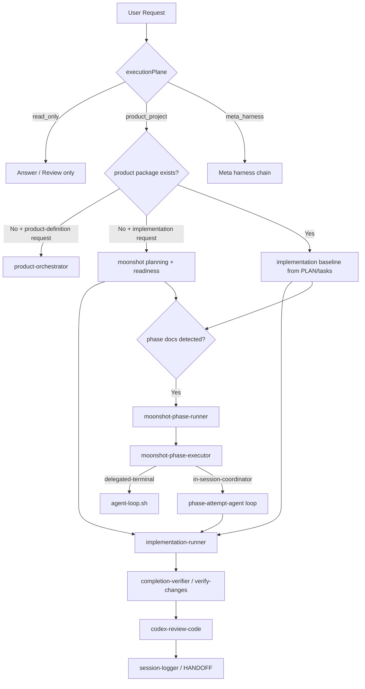

# Workflow And Policy Application Map

Last-Reviewed: 2026-03-26

## Goal

이 문서는 현재 저장소의 워크플로우를 "실행 흐름" 기준으로 재구성한 분석 문서다.
특히 Codex 세션에서 정책이 언제 강제되고, 언제 단순 참고로만 남는지 보이도록 정리한다.

## Executive Summary

핵심 결론은 다음과 같다.

1. 항상 강제되는 것은 `AGENTS.md`나 `.claude/CLAUDE.md`가 아니라 `.claude/rules/**/*.md` 쪽이다.
2. 하지만 실제 운영 절차의 상당수는 `.claude/docs/guidelines/*.md` 와 `skills/*.md` 에 들어 있으므로, `moonshot-orchestrator` 체인을 타지 않으면 적용 약도가 크게 떨어진다.
3. `.claude/PROJECT.md` 는 아직 템플릿 상태라 프로젝트별 계약 정보가 비어 있다. 그래서 Codex가 "구체적인 명령/검증/구조 규칙"을 읽어도 실행 가능한 정책으로 쓰기 어렵다.
4. 현재 기본 프로파일은 `strict` 가 아니라 `standard` 이다. 이 모드에서는 검증 계약 부재와 검증 불확실성이 경고로만 남고, 차단으로 이어지지 않는다.

## 1. Load Tier Map

### 1.1 Always loaded

이 레이어는 Codex가 현재 저장소에서 작업하면 거의 항상 영향을 받는다.

- `AGENTS.md`
- `.claude/CLAUDE.md`
- `.claude/rules/**/*.md`

실제 의미:

- `AGENTS.md`, `.claude/CLAUDE.md`
  - TOC 역할만 한다.
  - 자세한 정책을 담지 않도록 설계되어 있다.
- `.claude/rules/**/*.md`
  - 항상 로드되는 강제 규칙이다.
  - 현재 저장소에서 가장 안정적으로 반영되는 정책층이다.

### 1.2 Conditionally loaded

이 레이어는 특정 스킬이나 경로를 타야만 실질적으로 적용된다.

- `.claude/PROJECT.md`
- `.claude/docs/guidelines/*.md`
- `.claude/skills/**/*.md`
- `.claude/agents/**/*.md`

실제 의미:

- `.claude/PROJECT.md`
  - 참조 대상이지만, 현재 내용은 템플릿이다.
  - 명령/테스트/구조/깃 규칙이 프로젝트 현실로 채워져 있지 않다.
- `.claude/docs/guidelines/*.md`
  - 운영 절차의 source of truth 이지만 자동 강제는 아니다.
  - 보통 특정 skill 이 참조하거나 orchestrator 가 체인 안에서 불러야 살아난다.
- `.claude/skills/**/*.md`
  - 워크플로우 실행 로직이 여기 있다.
  - Codex가 해당 skill 을 직접 호출하거나, task 가 그 skill 설명과 명확히 맞을 때만 적극 반영된다.
- `.claude/agents/**/*.md`
  - 서브에이전트 역할 정의다.
  - phase loop 나 fork execution 같은 특수 흐름에서만 작동한다.

### 1.3 Path-scoped rules

항상 로드되더라도, 아래 규칙은 특정 경로를 수정할 때만 강하게 의미가 생긴다.

- `.claude/rules/docs/documentation.md`
  - `.claude/docs/**/*.md` 수정 시 적용
- `.claude/rules/agents/agent-definition.md`
  - `.claude/agents/**/*.md` 수정 시 적용
- `.claude/rules/agents/agent-delegation.md`
  - `.claude/agents/**/*.md`, `.claude/skills/**/*.md` 작업 시 적용

## 2. Control Plane Overview

이 저장소는 단일 규칙 집합이 아니라, `moonshot-orchestrator` 중심의 제어 평면을 가진다.

핵심 포인트:

- `moonshot-orchestrator` 가 실제 build control plane 이다.
- `product-orchestrator` 는 upstream 기획 체인이고, 코드 작성 엔진이 아니다.
- phase 문서가 감지되면 일반 구현 흐름 대신 `moonshot-phase-runner` 가 먼저 들어간다.

## 3. Workflow By Plane

### 3.1 `read_only`

대상:

- 설명
- 요약
- 조사
- 리뷰 전용 요청

흐름:

1. 기본 규칙 적용
2. 구현/검증 번들 미실행
3. 필요 시 review-only 경로 사용

적용 문서:

- 항상 적용: `basic-principles`, `communication`, `output-format`
- 부분 적용: `codex-review-code` 를 실제로 쓸 때만 review skill 규칙

관찰:

- 이 경로는 대부분의 운영 가이드를 건너뛴다.
- 사용자가 "분석만", "설명만" 요청하면 정책 체감이 가장 약하다.

### 3.2 `product_project`

대상:

- 일반 제품/서비스 구현
- 기능 추가
- 수정
- 리팩터링

#### A. 제품 정의부터 시작하는 경우

진입 조건:

- 요청이 아직 아이디어/기획 단계
- product package 부재

흐름:

1. `product-orchestrator`
2. `PRODUCT_INTENT`
3. `PRD`
4. `SOLUTION`
5. `SPEC`
6. `PLAN`
7. `tasks/*.md`
8. `moonshot-orchestrator` 로 handoff

적용 문서:

- `.claude/docs/guidelines/product-definition-workflow.md`
- `product-gate-reviewer`
- `task-slicer`
- `assumption-ledger`

#### B. 구현 요청인데 product package 가 없는 경우

흐름:

1. `pre-flight-check`
2. `project-contract-gate`
3. `context-readiness-gate`
4. `verification-contract-gate`
5. `requirements-analyzer`
6. `context-builder`
7. `codex-validate-plan`
8. `karpathy-execution-gate`
9. `implementation-runner`
10. `completion-verifier`
11. `codex-review-code`
12. `session-logger` / `efficiency-tracker`

적용 문서:

- `.claude/docs/guidelines/context-readiness-schema.md`
- `.claude/docs/guidelines/verification-contract.md`
- `.claude/docs/guidelines/document-memory-policy.md`
- `.claude/docs/guidelines/long-running-harness.md`

#### C. product package 가 이미 있는 경우

차이점:

- `requirements-analyzer`, `context-builder` 를 건너뛴다.
- `PLAN.md`, `tasks/*.md` 를 구현 기준선으로 사용한다.
- medium/complex 이면 execution bridge artifact 를 요구한다.

execution bridge artifact:

- `SPRINT_CONTRACT.md`
- `QA_REPORT.md`
- `HANDOFF.md`

### 3.3 `meta_harness`

대상:

- `.claude/skills`
- `.claude/rules`
- `.claude/agents`
- harness script
- installer/distribution logic

흐름:

1. `pre-flight-check`
2. `project-memory-check`
3. `karpathy-execution-gate`
4. `implementation-runner`
5. `completion-verifier`
6. `codex-review-code`
7. `session-logger`

특징:

- downstream product bootstrap gate 를 건너뛴다.
- 현재 요청처럼 "이 저장소의 워크플로우 자체"를 분석하거나 수정하는 작업은 사실상 이 plane 에 가깝다.
- core workflow 파일을 수정하면 `workflowProfile` 이 `strict` 로 승격될 수 있다.

## 4. Policy Application Timeline

### 4.1 요청 수신 직후

적용:

- `.claude/rules/basic-principles.md`
- `.claude/rules/communication.md`
- `.claude/rules/output-format.md`
- `.claude/rules/workflow.md`

의미:

- 한국어 응답
- 불필요한 대화 최소화
- 코드 작업이면 orchestrator 우선
- 복잡 작업은 plan -> implement -> verify -> summarize

### 4.2 작업 유형 판정 시점

적용:

- `.claude/rules/workflow.md`
- `moonshot-orchestrator`
- `moonshot-classify-task`
- `moonshot-evaluate-complexity`
- `moonshot-detect-uncertainty`

의미:

- `executionPlane` 판정
- `workflowProfile` 판정
- product-definition request 여부 판정
- 복잡도별 체인 선택

### 4.3 사전 점검 시점

적용:

- `pre-flight-check`
- `.claude/docs/guidelines/document-memory-policy.md`
- `.claude/docs/guidelines/context-readiness-schema.md`
- `.claude/docs/guidelines/verification-contract.md`

의미:

- `PROJECT.md` 준비 여부
- `context.md` 최소 스키마 충족 여부
- verification contract 존재 여부
- 큰 문서/오래된 문서/아카이브 구조 확인

주의:

- `pre-flight-check` 는 "발견" 담당이다.
- 실제 차단은 아래 gate skill 이 한다.

### 4.4 Gate 적용 시점

적용 순서:

1. `project-contract-gate`
2. `context-readiness-gate`
3. `verification-contract-gate`
4. `design-approval-gate` (`strict` 일 때)
5. `workspace-isolation-gate` (`strict` 일 때)
6. `karpathy-execution-gate`

의미:

- downstream product 작업에서 필요한 최소 문서 계약을 확인한다.
- strict 가 아니면 일부는 경고로만 지나간다.
- `karpathy-execution-gate` 는 구현 직전 범위/가정/검증을 짧게 고정한다.

### 4.5 구현 직전/구현 중

적용:

- `.claude/rules/scope-confirmation.md`
- `.claude/rules/refactoring-guidelines.md`
- `.claude/rules/testing.md`
- `.claude/rules/security.md`
- `implementation-runner`

의미:

- 리팩터링은 IN/OUT scope 확인 필수
- 테스트 환경이 있으면 테스트 동반 작성
- 없으면 self-audit 로 계속 진행
- 보안 이슈 발견 시 관련 변경 중단
- medium/complex 는 `SPRINT_CONTRACT.md` 선행

### 4.6 검증/완료 판정 시점

적용:

- `completion-verifier`
- `.claude/docs/guidelines/verification-contract.md`
- `.claude/rules/quality.md`
- `.claude/rules/testing.md`
- `verification-evidence-gate` (`strict` 일 때)

의미:

- 검증 우선순위는 verification contract -> PROJECT Testing Rules -> 자동 탐지
- 검증 환경이 없으면 `indeterminate`
- standard 는 `pass_with_warning` 가능
- strict 는 fresh evidence 없으면 완료 주장 차단

### 4.7 장기 실행/phase loop 시점

적용:

- `.claude/docs/guidelines/long-running-harness.md`
- `moonshot-phase-runner`
- `moonshot-phase-executor`
- `moonshot-in-session-coordinator`
- `phase-attempt-agent`
- `session-logger`

의미:

- phase 별로 `SPRINT_CONTRACT`, `QA_REPORT`, `HANDOFF` 를 유지한다.
- 재시도는 채팅 문맥이 아니라 artifact 기반으로 이어간다.
- delegated-terminal 모드는 `agent-loop.sh` 가 어댑터 역할을 한다.

## 5. Why Policy Reflection Is Weak In Codex

### 5.1 `PROJECT.md` 가 비어 있다

현재 `.claude/PROJECT.md` 는 템플릿 그대로다.

영향:

- 프로젝트 개요 없음
- 실제 명령어 없음
- 테스트/검증 규칙 없음
- 구조/패턴 설명 없음
- Git workflow 도 템플릿 예시 수준

즉, Codex가 프로젝트 계약을 참조하더라도 실행 가능한 현장 규칙을 얻지 못한다.

### 5.2 운영 정책이 always-loaded 가 아니다

실제 운영 절차는 아래에 많이 들어 있다.

- `.claude/docs/guidelines/*.md`
- `.claude/skills/**/*.md`

이 문서들은:

- orchestrator 가 해당 흐름을 구성하거나
- 사용자가 특정 skill 을 직접 트리거하거나
- 현재 작업이 그 skill 설명과 강하게 일치할 때

비로소 살아난다.

그래서 Codex가 단순히 파일을 읽고 곧바로 수정하는 경로를 타면, 이 정책층은 충분히 작동하지 않는다.

### 5.3 기본 프로파일이 `standard` 다

현재 설계상 `strict` 는 아래 때만 주로 켜진다.

- 사용자가 엄격 모드를 명시
- 프로젝트 정책이 strict 를 요구
- `meta_harness` 에서 core workflow 파일 수정

그 외에는 `standard` 가 기본이다.

영향:

- verification contract 부재: 경고
- 실행 가능한 검증 부재: `pass_with_warning`
- 불확실한 상태: 진행 가능

즉 "정책이 안 먹는다"기보다 "정책이 기본적으로 hard gate 가 아니다"에 가깝다.

### 5.4 read-only/direct-skill bypass 가 허용된다

`workflow.md` 와 `moonshot-orchestrator` 는 기본적으로 code work 에 orchestrator 를 권장하지만, 아래는 우회 가능하다.

- read-only 요청
- direct skill 요청
- self-host/meta-work

따라서 사용자가 분석/설명/간단 수정 형태로 요청하면 전체 gate 체인이 실행되지 않을 수 있다.

### 5.5 Knowledge repo 정책도 placeholder 를 허용한다

`.claude/docs/guidelines/knowledge-repository-ops.md` 에 따르면 이 저장소 같은 template repo 에서는 `PROJECT.md` placeholder 가 허용된다.

추가로:

- `KNOWLEDGE_REQUIRE_PROJECT_FILLED=true` 일 때만 강제
- 그렇지 않으면 placeholder hit 는 metric 으로만 보고된다

즉 현재 구조는 "비어 있는 PROJECT 를 경고는 하지만 막지는 않는" 설계다.

## 6. Practical Hardening Options

우선순위 기준 권장 순서는 아래다.

1. `.claude/PROJECT.md` 를 실제 저장소 계약으로 채운다.
2. `.claude/verification.contract.yaml` 을 만든다.
3. Codex entry policy 를 always-loaded rule 에서 더 짧고 명시적으로 고정한다.
4. core workflow 작업은 기본 `strict` 로 승격되도록 조건을 더 명확히 한다.
5. read-only/direct edit 경로에서도 최소 `pre-flight-check` 를 강제하는 규칙을 보강한다.

가장 효과가 큰 2개:

- `PROJECT.md` 실체화
- verification contract 추가

이 둘이 없으면 Codex는 "참조할 문서가 있다" 수준은 만족해도, 실행 판단에 쓸 구체 정책을 얻지 못한다.

## 7. Current State Checklist

현재 저장소 기준 상태:

- `AGENTS.md`: TOC 역할로 정상
- `.claude/CLAUDE.md`: TOC 역할로 정상
- `.claude/rules/**/*.md`: 항상 로드되는 핵심 강제층
- `.claude/PROJECT.md`: 템플릿 상태
- `.claude/verification.contract.yaml`: 존재
- `.claude/docs/phase-status.yaml`: 없음
- phase execution artifact: 아직 없음

운영 해석:

- 기본 규칙은 반영되지만
- meta_harness용 verification contract는 존재하지만 scope 기반으로만 적용되고
- 엄격한 gate 는 대부분 아직 자동 차단으로 작동하지 않는다

## 8. Audit Evidence

`bash .claude/scripts/knowledge-repo-audit.sh` 실행 결과:

- verdict: `passed`
- errors/warnings: `0 / 0`
- always-loaded lines: `197`
- always-loaded total lines: `237`
- always-loaded estimated tokens: `2153 / 2200`
- `requireProjectFilled`: `false`
- `projectPlaceholderHits`: `74`

해석:

- 저장소 구조와 링크 관점에서는 건강하다.
- 하지만 감사 정책이 현재 `PROJECT.md` placeholder 를 차단하지 않는다.
- 항상 로드되는 토큰 예산도 이미 상한선 근처라, 정책을 더 넣기보다 핵심 규칙만 남기고 나머지는 skill/gate 로 연결하는 현재 구조가 유지되고 있다.

## 9. Recommended Reading Order

실제 흐름을 다시 따라가려면 이 순서가 가장 빠르다.

1. `AGENTS.md`
2. `.claude/CLAUDE.md`
3. `.claude/rules/workflow.md`
4. `.claude/README.md`
5. `.claude/skills/moonshot-orchestrator/SKILL.md`
6. `.claude/skills/moonshot-decide-sequence/SKILL.md`
7. `.claude/docs/guidelines/product-definition-workflow.md`
8. `.claude/docs/guidelines/verification-contract.md`
9. `.claude/docs/guidelines/long-running-harness.md`

## 10. Bottom Line

현재 저장소는 "정책이 없다"가 아니라, "정책이 여러 층으로 분리되어 있고 그중 강한 층과 약한 층이 다르다"가 정확한 상태다.

Codex에서 정책 반영이 약하게 느껴지는 직접 원인은 다음 조합이다.

- always-loaded 영역이 얇다
- 실제 운영 규칙은 skill/guideline 에 많다
- `PROJECT.md` 가 비어 있다
- verification contract 가 없다
- 기본 프로파일이 strict 가 아니다

따라서 정책 반영률을 높이려면 문서를 더 많이 쓰는 것보다, "항상 강제되는 최소 규칙"과 "실행 가능한 프로젝트 계약"을 먼저 강화해야 한다.
