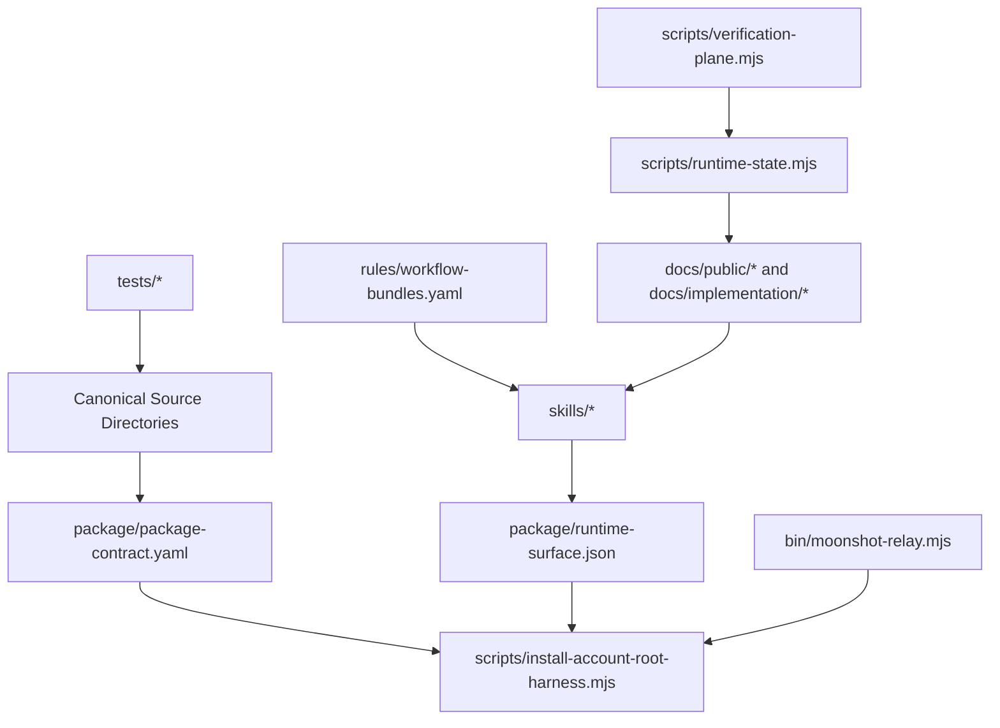

# C4 Container

## Containers

```mermaid
flowchart TB
  Source[Canonical Source Directories]
  PackageContract[package/package-contract.yaml]
  RuntimeSurface[package/runtime-surface.json]
  Installer[scripts/install-account-root-harness.mjs]
  CLI[bin/moonshot-relay.mjs]
  RuntimeState[scripts/runtime-state.mjs]
  VerificationPlane[scripts/verification-plane.mjs]
  WorkflowBundles[rules/workflow-bundles.yaml]
  Skills[skills/*]
  Tests[tests/*]
  Docs[docs/public/* and docs/implementation/*]

  Source --> PackageContract
  PackageContract --> Installer
  RuntimeSurface --> Installer
  CLI --> Installer
  Skills --> RuntimeSurface
  WorkflowBundles --> Skills
  RuntimeState --> Docs
  VerificationPlane --> RuntimeState
  Tests --> Source
  Docs --> Skills
```

ASR links: ASR-101, ASR-102, ASR-103, ASR-104, ASR-105, ASR-106, ASR-107.
