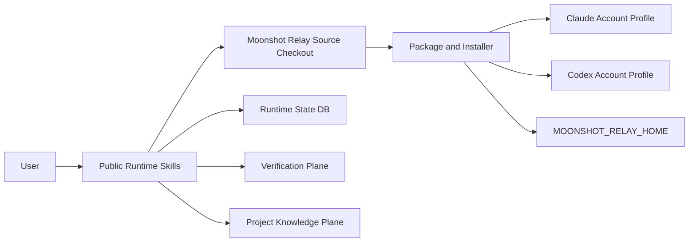

# C4 Context

## System Boundary

Moonshot Relay is a local workflow harness used by Claude and Codex to plan, execute, verify, package, and close out software work.

Requirement links: REQ-101, REQ-102, REQ-103, REQ-104, REQ-105, REQ-106, REQ-107.
