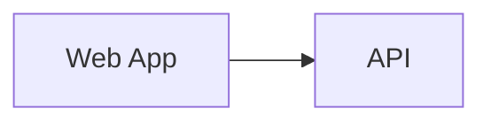

# C4 Container

## Output Path Contract

When materialized into an architecture package, write this artifact to `C4/C4_CONTAINER.md`.

## Containers

| Container | Responsibility | Technology | ASR IDs |
|---|---|---|---|
|  |  |  | ASR-001 |

## Container Interactions

| Source | Target | Protocol | Data |
|---|---|---|---|
|  |  |  |  |

## Container Diagram Source

