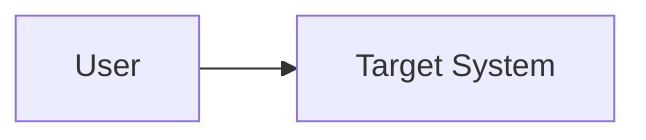

# C4 Context

## Output Path Contract

When materialized into an architecture package, write this artifact to `C4/C4_CONTEXT.md`.

## System Boundary

Describe the system boundary and external actors.

## People And External Systems

| Name | Type | Relationship | Requirement IDs |
|---|---|---|---|
|  | person/system |  | REQ-001 |

## Context Diagram Source

